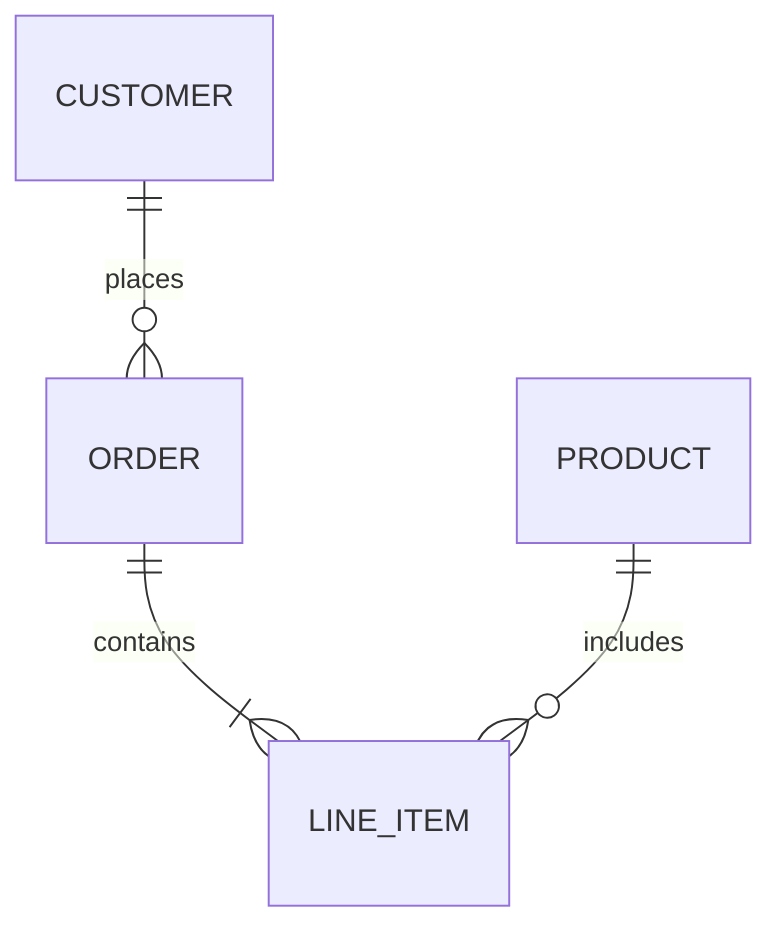
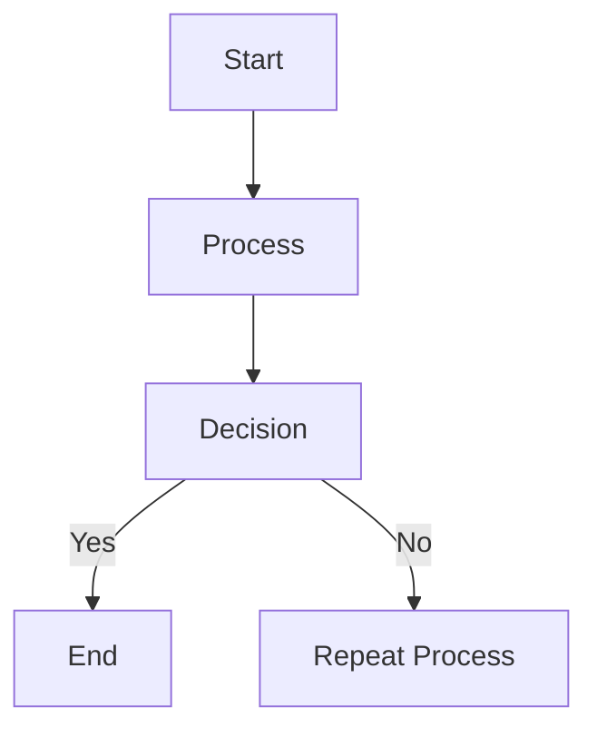
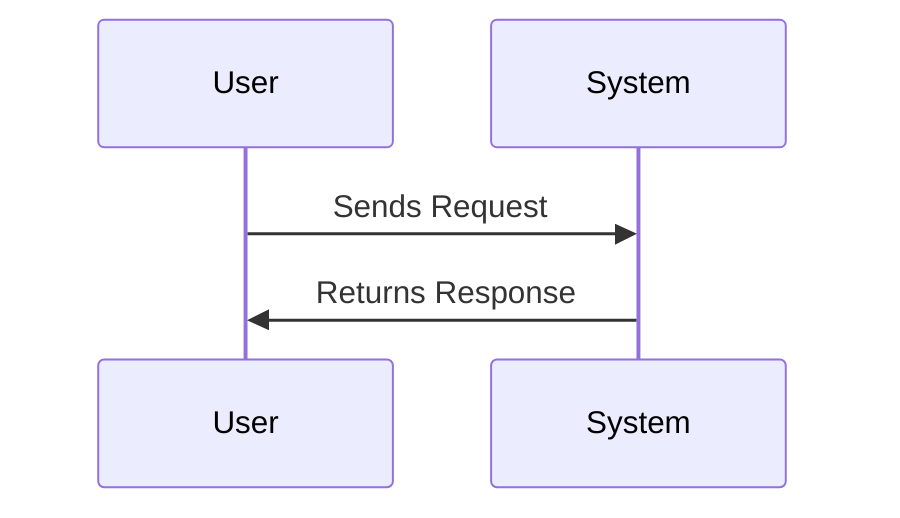

### 1. Headers
Headers in Markdown are created by using the `#` symbol. The number of `#` symbols determines the header level.

```
# H1 Header 
## H2 Header 
### H3 Header
```
### 2. Emphasis
- **Bold**: Wrap the text in `**` or `__`.
    ```
    **This is bold**
    ```

- _Italic_: Wrap the text in `*` or `_`.
    ```
    *This is italic*
``

- _**Bold and Italic**_: Use `***` around the text.
    ```
    ***This is bold and italic***
	```

### 3. Lists
- **Unordered List**: Use `-`, `*`, or `+`.
    ```
    - Item 1
    - Item 2
	```

- **Ordered List**: Use numbers followed by a period.
    ```
    1. First item
    2. Second item
	```

### 4. Links and Images
- **Links**: `[Link text](URL)`
    ```
    [OpenAI](https://www.openai.com)
	```

- **Images**: ``
    ```
    
	```

### 5. Blockquotes
Use `>` to create blockquotes.
```
> This is a blockquote.
```

### 6. Code Blocks
Wrap code in triple backticks and specify the language for syntax highlighting.
```sql
SELECT * FROM employees;
```

For inline code, use single backticks: `` `code` ``.

---

## Advanced Markdown Formatting in Obsidian

### 1. Tables
Markdown tables use pipes `|` to separate columns and hyphens `-` for headers.

```
| Name       | Position       | Department | 
|------------|----------------|------------| 
| Alice      | Manager        | Sales      | 
| Bob        | Developer      | IT         |
```

### 2. Checklists
Checklists are interactive in Obsidian, so you can check items off directly.

```
- [x] Task 1 
- [ ] Task 2
```

### 3. Footnotes
Footnotes are formatted using `[^1]` in the text and `[^1]: Footnote content` at the bottom.

```
Here's some text with a footnote.[^1]  [^1]: This is the footnote content.
```

### 4. Embedding Internal Links and Files
To link to other notes within Obsidian, use `[[Note Title]]`. You can also link to specific headings in a note like `[[Note Title#Heading]]`.

For embedding files like images or PDFs, use `![[File Name.pdf]]`.

---

## Using Mermaid for Diagrams (ER Diagrams and More)
Obsidian supports **Mermaid** for creating diagrams like ER diagrams, flowcharts, and sequence diagrams. To use it, wrap the code in a Mermaid code block:

### ER Diagrams (Entity-Relationship Diagrams)
ER diagrams are useful for visualizing database schemas. Here's the format for creating one in Mermaid:



#### Example Breakdown
- `||--o{` represents a **one-to-many** relationship.
- `||--|{` represents a **many-to-many** relationship.

### Flowcharts
To create a flowchart, use `graph TD` for a top-down layout or `graph LR` for left-to-right. Here's a simple example:


### Sequence Diagrams
Sequence diagrams can be helpful for showing interactions in a process flow:

