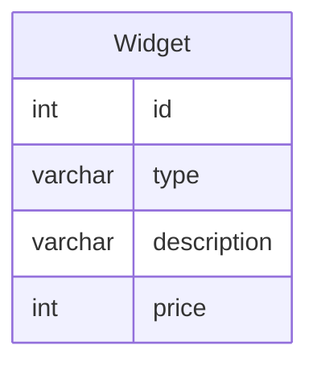

(1)  [12 marks] Explain what is meant by the following terms. You **MUST** use examples and/or diagrams to explain your answer:

- (i) Primary key 
	- A primary is an identifier for a row, this will be a unique value to that row for example

- (ii) Weak entities in an ER diagram, and how they are mapped into a relational schema.
	- A weak entity is one without a Primary Key, this must rely on another table for it's Primary Key, this comes as a Foreign Key.

- (iii) The degree and cardinality of a relation
	- Degree - Number of columns, imagine a table of students has columns: "name", "age", "student id" rows, this means it has a Degree of 3.
	- Cardinality - Number of rows, imagine a table of students has 6 rows, this means it has a cardinality of 6.
	
- (iv) Integrity constraints
	- A set of rules which maintain the quality of data, for example:
		- Primary key values must be unique

(2) Assume a relational database with two tables, as follows:

- Book = (ISBN, Name, Author, Publisher) 
- Publisher = (Name, Address, Phone Number) 

where the Publisher attribute in Book is a foreign key referring to the Name attribute of Publisher.

- (a) Write the relational algebra for a query that will return the IBSN numbers of all books published by "O'Reilly". [2 marks] 
$$FilteredPublisher:=\sigma_{(Name = O'Reilly)}[Publisher]$$$booksPublishedBy:=(FilteredPublisher \bowtie_{(FilteredPublisher.Name=Book.Author)} Book)$
$$project := \pi _{ISBN} ( booksPublishedBy )$$


$$FilteredDegree:=\sigma_{(Degree=Physics)}[Student]$$
$$FilteredClass:=\sigma_{(ClassCode=PHY1)}[Class]$$
$$PartiallyJoined:=(FilteredClass \bowtie_{(FilteredClass.ClassCode=EnrolledIn.Class)} EnrolledIn)$$
$$Joined:=(PartiallyJoined \bowtie_{(PartiallyJoined.Student=FilteredDegree.StudentID)} FilteredDegree)$$
$$project := \pi _{StudentID, Name} (Joined)$$


- (b) Write an SQL query that will return the Title, Author, Publisher name and publisher address for books with "Johnson" as author. [3 marks] 

```sql
SELECT Book.Name, Book.Author, Book.Publisher, Publisher.Address
FROM Book, Publisher
WHERE Book.Name = Publisher.NAME, Book.Author = "Johnson"
```

- (c) Write an SQL query that will identify the number of different publishers used by each author. [2 marks] 

```sql
SELECT Author, COUNT(DISTINCT *) AS Number of Publisher
FROM Book
GROUP BY Author
```

(3) [3 marks]
- (i) For any set, S, is it true that $\emptyset \subseteq S$? Why or why not? 
	- True

- (ii) Let U = {1,2,3,4}. If A= {x | x > 2}, then is the following true or false? Why? 
	- A = {4,3} 
	- True
	
- (iii) What is the cardinality the following sets?
	- {a,b,c,a,c} {{a}}
	- 3, 1

(4) A company holds data about the widgets that it manufactures. Each widget has a unique identifier, a type, a textual description and a price. The company has a set of warehouses, each with a unique identifier and an address, consisting of a street address, city and postal code. All widgets are stored in warehouses. Each warehouse can hold many widgets, but a widget can, of course, only be stored in a single warehouse (at any given time). 

Draw an ER diagram that represents the structure of the company's data. 

- If you were transforming this schema into a relational representation, how would you handle the association between the widgets and warehouses? 

[8 marks]



$$FilteredDegree:=\sigma_{(Degree=Physics)}[Student]$$
$$FilteredClass:=\sigma_{(ClassCode=PHY1)}[Class]$$
$$PartiallyJoined:=(FilteredClass \bowtie_{(FilteredClass.ClassCode=EnrolledIn.Class)} EnrolledIn)$$
$$Joined:=(PartiallyJoined \bowtie_{(PartiallyJoined.Student=FilteredDegree.StudentID)} FilteredDegree)$$
$$project := \pi _{StudentID, Name} (Joined)$$
