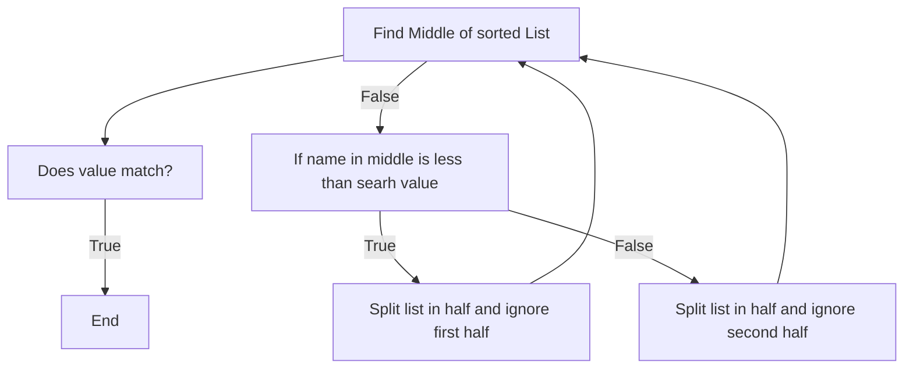
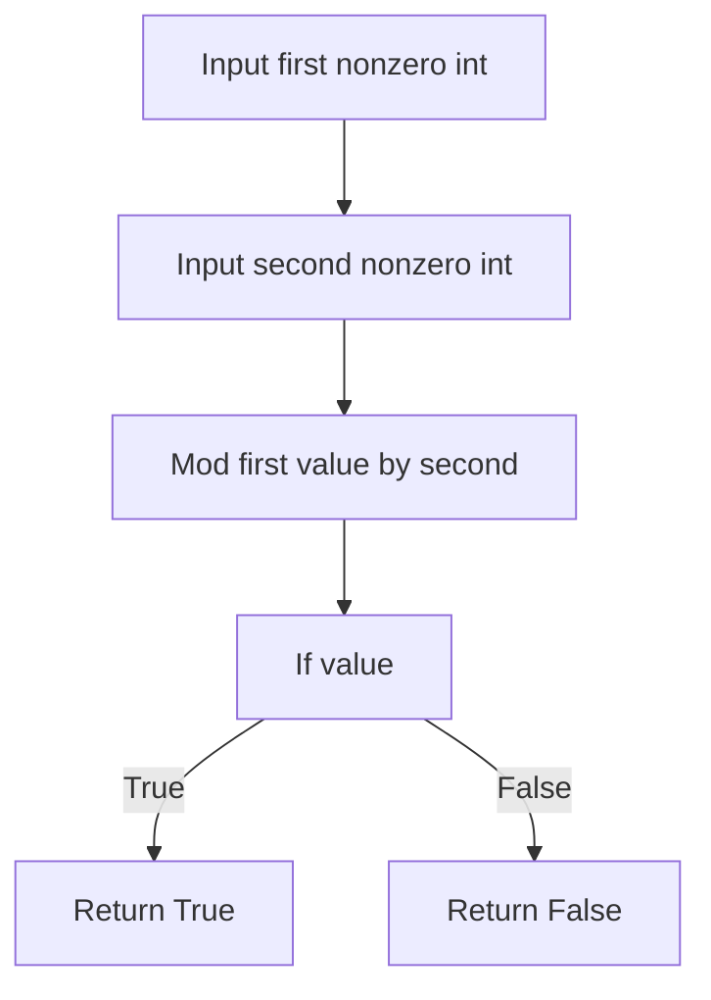
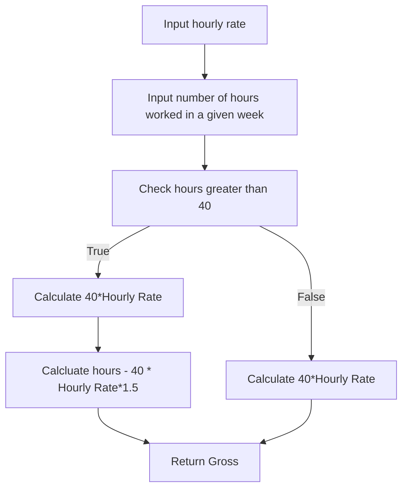
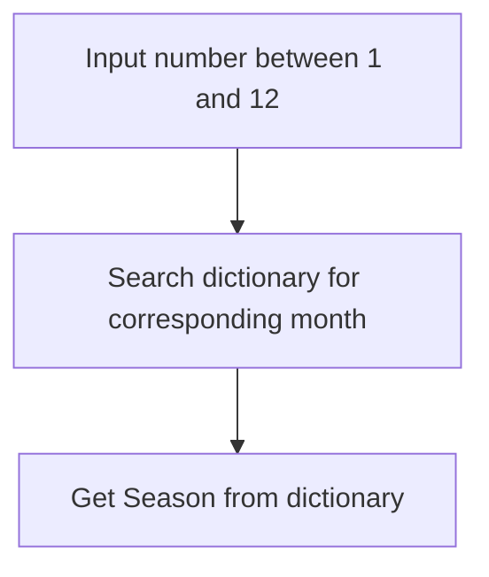
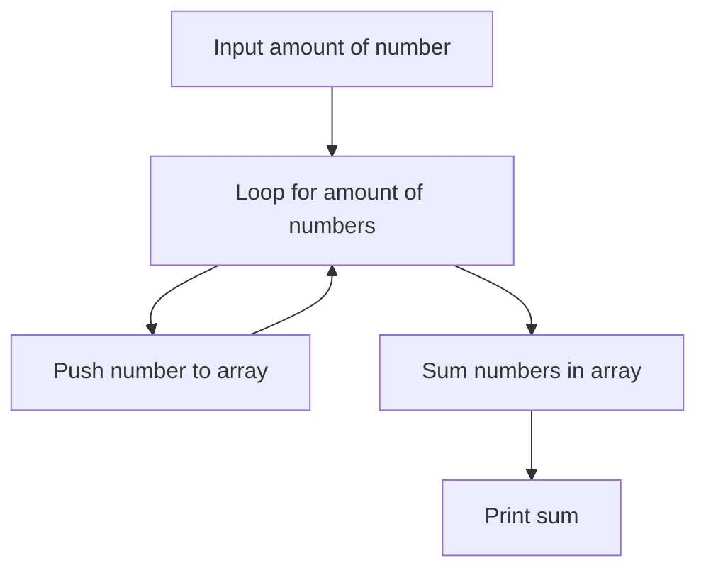
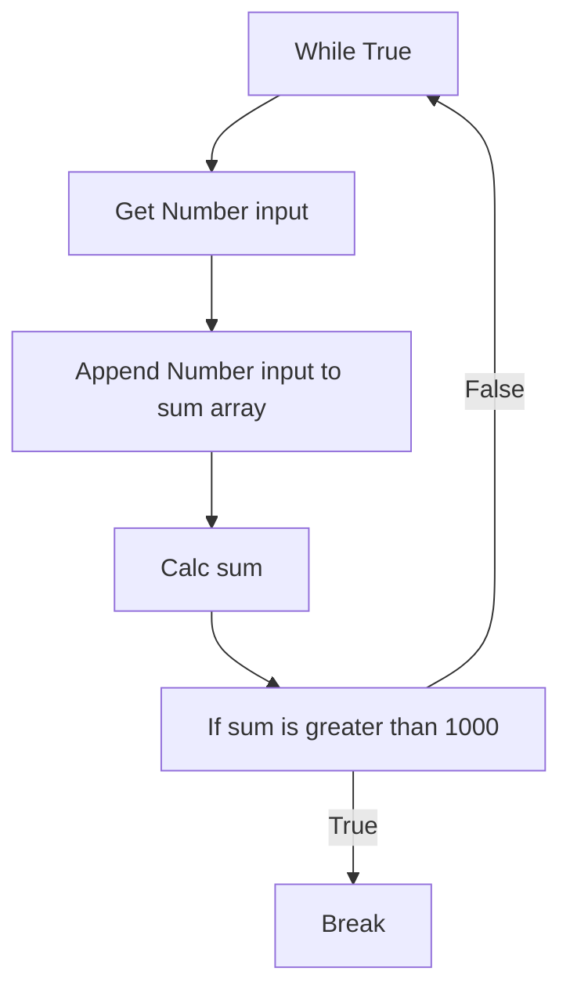
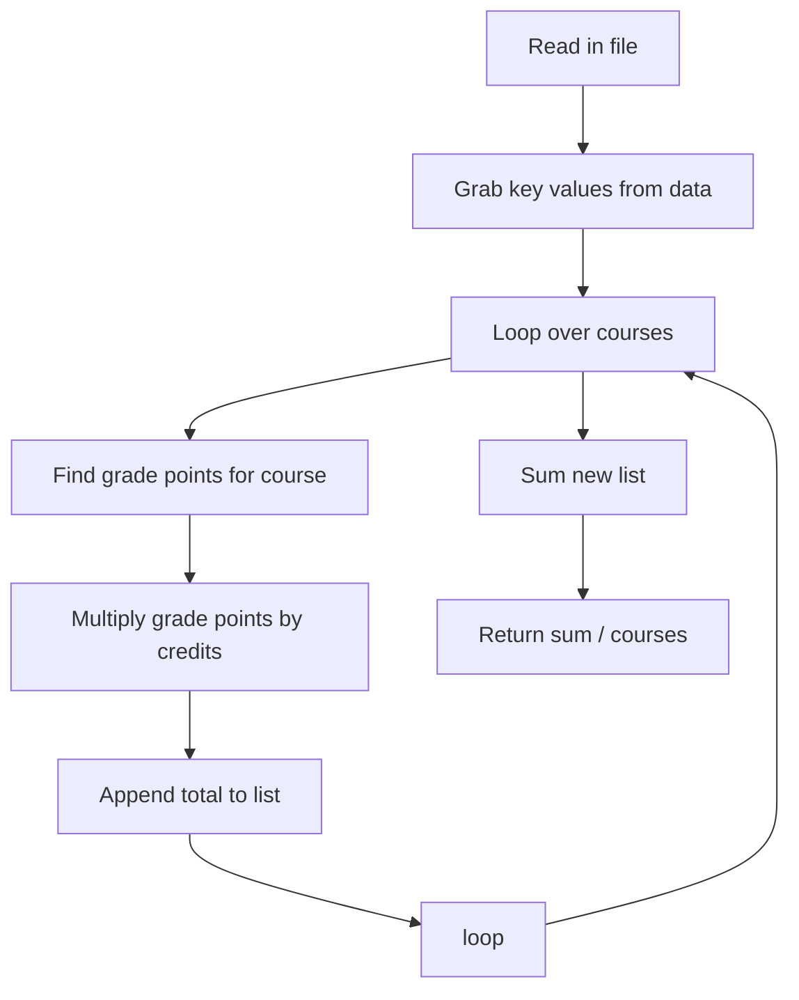

 - [[Software Engineering/Year 2/Practical Algorithms/Slides/2. Algorithm Analysis/Algorithmic Thinking and Decomposition.pdf]]
## Introduction to Algorithms
Solving 'problems' with Algorithms or in other words, creating an "Algorithm" 

#### Three Main Stages
- Data input
- Data Processing
- Data Output

### How Do We Do the "Data Processing" Bit
Learning syntax and semantics of python (or other languages) is important but…

- The skill we want to learn is: how do we think computationally (emphasize with a computer, so to speak), so that then we can write algorithms that solve a given problem.
- Institutions, guesstimates, gut-feelings, are not going to work on their own (though will likely inform the process)
- So, what does work then?
	- Less of Picard, more of Data??

#### Thinking like a Computer?
The key skills we will need to start more "computationally", so that we can write programmatic solutions that computers can solve:
- Algorithmics Thinking, functional thinking, one step at a time (up next)
- Analysis (coming up soon)
- Decomposition, breaking down problems into bitsize chunks (for more complex problems)

We also need to develop general thinking skills, which will reduce code duplication especially in algorithms:
- Abstraction
- Generalization

#### Algorithmics Thinking
'Steps' in an Algorithm

- What is the 'size' of these steps?
	- Think in human terms first:
		- Baking a cake:
			- To a baker:
				- Step 1: Bake a 2lb cake
				- Step 2: Here's your money
			- To me:
				- Step 1: Get a cup
				- Step 2: Open the tap
				- ….

Steps are dependent on the audience we need to break it down to understandable chunks for a machine, get it as simple as assembly level.

#### Universal Building Blocks
Three operations used to construct an algorithm:
- Sequential Operations, one step after another
- Conditional Operations - if something do this step, else do another
- Iterative Operations, looping over steps

#### Sequential Operations
- Input
- Compute (run calculations on input)
- Output

#### Conditional Operations
- 'question asking' operations.

```python
var = 'help'

if var == 'help':
	print('helping')
else:
	print('not helping')
```

#### Iterative Operations
- looping over steps
- Also includes recursion
- Two loops
	- Pre test - for loops
	- Post test - while loops

```python
var = 1

while var < 6:
	print(str(var))
	var += 1
```

## Flowchart and Pseudocode
Writing efficient and correct algorithms in programming language so that a computer can run it (a lot faster and with a lot less mistakes than us) remains the key skill we want to learn.

But, unless you are solving a really simple problem, jumping right into coding when given a problem statement is usually not the most efficient way to go about it.

- [Designing an algorithm](https://www.bbc.co.uk/bitesize/guides/z3bq7ty/revision/1)
- [Pseudocode](https://www.bbc.co.uk/bitesize/guides/z3bq7ty/revision/2)
- [Flowchart](https://www.bbc.co.uk/bitesize/guides/z3bq7ty/revision/3) 

 Flowcharts can be a bit unwieldy, and if you are working on a computer, you generally need specialized software to draw them, but I personally find it a lot easier to understand them. Your personal preferences, the context, the size of the algorithm will be the deciding factors for which one works best each time. Long story short, you should be conversant in all the above representations.
## Data Structures

**Case Study: Planning/Problem Solving**
- Calculating students' grade points average
- Data on students, their modules and grades is stored in a file (one student can have multiple modules)

| Matric Number | Module Code | Credits | Grade |
| ------------- | ----------- | ------- | ----- |
| 0606559       | VBN2        | 40      | A     |
|               |             |         |       |
Grade Points Averages

- For each student, the following calcs must be done.
- Each grade is converted into points using this table

| A   | B   | C   | D   | E   | F   | G   |
| --- | --- | --- | --- | --- | --- | --- |
| 16  | 14  | 12  | 10  | 8   | 6   | 2   |

- Grade points for each module:
	- the number of credits is multiplied by the grade points corresponding to the grade
- Total grade points:
	- Grade points for all modules are added up to give the total grade points for the student.
- Grade point average (GPA):
	- Total grade points divided by number of credits

For example for this student `0605456 LKJ1 10 G CDS2 30 C`

| Matric Number           | 0605456         |
| ----------------------- | --------------- |
| Credits for LKJ1        | 10              |
| Grade points for course | 10 x 2 =20      |
| Credits for CDS2        | 30              |
| Grade points for course | 30 x 12 = 360   |
| Total grade points      | 360+20=380      |
| Grade point average     | 380/(30+10)=9.5 |

 > ***Note: You need both (a) total grade points and (b) total credits to then compute the grade point average***

Write a program to: 
1. **read** in students' data from a file, 
2. **calculate** the GPA for each student, & 
3. **print** the GPA of each student, separated into two categories:
	- students with a GPA of at least 10.0, and
	- students with a GPA of less than 10.0

Students with GPA >= 10.0 
	0606559 190 10.2 
	0601234 80 15.0 

Students with GPA < 10.0 
	0500300 60 9.0 
	0605456 40 9.
#### Planning
How do we begin writing a program, we need a plan… A cunning plan.

To develop a plan, we need to think about: 
- data structures for the problem, and 
- the necessary algorithms 
- i.e., the sequence of steps to solve the problem 

In other words: 
- what data do we need to store, and what is the appropriate structure to store it; and
- how do we process it?

**Do we need to store anything at all?**
If we are aiming to print the data in the required format we will need to store to group the data once the calculations have finished.

**How should we store it?**
- We could use a dictionary:
```
"0605456": { "credits":40, "gpa":9.5 }
```

**Top Level Plan**
1. Read data from the file, line by line
2. Store credits and GPA in dictionary
3. Print data in two groups

> I'd say step two and three might need broken down into smaller steps this is where ***Decomposition*** comes into this.

#### Decomposition
We can simplify this Top Level Plan into:

1. Read data from the file, line by linear
2. Store credits and GPA in directory. 
	1. Split the current line into a list of strings
	2. For each module, add the credits to a running total
	3. For each module add the grade points to a running total
	4. Calculate the GPA

How do we store the constants (grade table):
- Dictionary is the way to go
- Although - I would just go with a read-only Enum, a-lot cleaner

```python
# Werid funky code
def gp(g):
	table = {
		'A':16,
		'B':14,
		'C':12,
		'D':10,
	}
	return table.get(g,0)
```

```typescript
// Nice looking enum code
const enum Grades {
	A = 16,
	B = 14,
	C = 12,
	D = 10
}

console.log(Grades.A)
```

1. Print data in two groups
	1. For each student in the dictionary, if GPA >= 10.0: print details
	2. For each student in the dictionary, if GPA < 10.0: print details 

#### The Function Process

```
def output(r): 
	#Print students with GPA >=10
	print("Students with GPA >= 10.0")
	print()
	
	for m in r: 
	# m is each matric number in turn if r[m]["gpa"] >= 10.0: print(m, r[m]["credits"], r[m]["gpa"]) print() #Print students with GPA < 10 print("Students with GPA < 10.0") print() for m in r: # m is each matric number in turn if r[m]["gpa"] < 10.0: print(m, r[m]["credits"], r[m]["gpa"])
```
# 2.1 Problem Set: Algorithmic Thinking
- [x]  🔽 ✅ 2024-11-03
[link](https://moodle.gla.ac.uk/mod/book/view.php?id=4586539&chapterid=162827)

**1a)**
- Input - Name
- Data Processing (Binary Search)
- Output - Location

**1b)**
1. Start in the middle.
2. If the value at the midpoint is less than the name, the list is divided in half, the lower half of the list is ignored and the search keeps to the upper half of the list.
3. Same goes in the other direction
4. The search moves to the midpoint of the remaining items. Steps 2 through 4 continue until a match is made or there are no more items to be found.

**2a)** Just loop through without any fancy technique

**3a)** We have another perspective compared to a computer, we can see all data Infront of us, best way would be something similar to a bubble search except you compare with entire array and move directly to it's index.

# 3.1 Problem Set: Flowchart and Pseudocode
- [x]  🔽 ✅ 2024-11-03
[Link](https://moodle.gla.ac.uk/mod/book/view.php?id=4586539&chapterid=162830#mod_book-chapter)

**1)** Refer back to your solution for finding the number against the given name in a telephone directory. 

**1a)** Express your algorithm as a flow chart.




**1b)** Express your algorithm in pseudocode (use the BBC Bitesize way of writing it or, if you have your own way of doing it already, feel free to use that).

```
searchValue = 'liam';
found = false;
list = [chonky list]

while (found = false and not list === []) {
	if (array === []) {
		found = false
		throw Error
	}

	let middle = middle of list

	if (middle === searchValue) {
		found = true
		end loop
		return
	}

	If (name.compare(searchValue)) {
		list = second half of list
	} else {
		list = first half of list
	}
}
```

---
# 4.1 Problem Set: Algorithmic Building Blocks
- [x]  🔽 ✅ 2024-11-03
[Link](https://moodle.gla.ac.uk/mod/book/view.php?id=4586539&chapterid=162828#mod_book-chapter)

In this problem set, we will just do some practice with the "algorithmic building blocks" we looked at in the parent chapter. We will start off with what will look like (and are) small, trivial exercises. But things will get "interesting" soon enough.  
  
So, let's get our engines running,  juices flowing, muscles warming, boat floating, etc etc.

---
  
**1)** Sequential operations


**1a)** Write a Python program that prompts for two inputs: the *before tax* price of an item, and the *discount* offered on it (as a percentage). The program should then calculate and display the new price, given that the sales tax rate is 17.5%.  

```python
# base = input('Before Tax:')
base = 10

# discountAsPercent = input('Discount as Percent:')
discountAsPercent = 20

salesTax = 17.5

def applyPercent(percent, val):
    percent = float(val) * (float(percent)/100)
    return val - percent

discounted = applyPercent(discountAsPercent, base)
taxed = applyPercent(17.5, discounted)

print(taxed)
```

  
**1b)** Write a program that prompts the user to enter their last name, and then creates a 6 character user id based on the first three letters of their surname (in lower case), and a 3 digit randomly generated number.  

```python
import random

def genID(val):
    nameID = val[:3]
    numID = round(random.randInt(100, 999))
    return nameID + str(numID)
    
# lastname = input('PLease enter your lastname:')
lastname = 'mcmanus'
id = genID(lastname)

print(id)
```

---

**2)** Conditional operations


**2a)** *[Single-alternative condition]* Draw/write the flowchart or pseudocode, and then write a Python program that asks the user to input two nonzero integers, and tells you if one is a multiple of the other (so, e.g., if you enter 18 and 6, or 6 and -18, it should return "True". If not, nothing displayed) .



```python
val1 = 3
val2 = 6

if (val1 % val2):
	print('true')
else:
	print('false')
```


**2b)** *[Dual-alternative condition]* Draw/write the flowchart or pseudocode, and then write a Python program that prompts the user for their hourly pay rate and the number of hours worked in a given week, and then returns their gross pay. The hourly rate applies for up to 40 hours of work; any hours worked over 40 are paid at 1.5 times the given hourly rate. 



```python
OVERTIME_HOURS = 40
OVERTIME_RATE = 1.5

def calcPay(hoursWorked, hourlyRate):
	print('Well done you done ' + str(hoursWorked) + ' hours')

	if (hours > OVERTIME_HOURS): 
		overtimeHours = hoursWorked - OVERTIME_HOURS
		print('And with ' + str(overtimeHours) + ' hours overtime')
	
		basePay = OVERTIME_HOURS * hourlyRate
		overtimePay = overtimeHours * hourlyRate * OVERTIME_RATE
		return basePay + overtimePay
	else:
		basePay = OVERTIME_HOURS * hourlyRate
		return basePay + overtimePay

rate = 6
# rate = input('Please enter your base rate')
hours = 44
# rate = input('Please enter your hours worked')

print(calcPay(hours, rate))
```


**2c)** *[Multiple-alternative conditions]* Draw/write the flowchart or pseudocode, and then write a Python program that prompts the user for a number between 1 and 12, corresponding to the month order, and then returns the season for that month, as per the following:

- Nov, Dec, Jan and Feb: Winter
- Mar and Apr: Spring
- May, Jun, Jul and Aug: Summer
- Sep and Oct: Autumn



```python
MONTH_TO_SEASON = {
    1: "Winter", 
    2: "Winter", 
	3: "Spring", 
    4: "Spring",
    5: "Summer", 
    6: "Summer",
    7: "Summer",
    8: "Summer",
    9: "Autumn",
    10: "Autumn",
    11: "Winter",
    12: "Winter", 
}

def findSeason(monthIndex):
    if monthIndex in MONTH_TO_SEASON:
        print(MONTH_TO_SEASON[monthIndex])

# index = int(input("Enter a month number (1-12): "))
index = 11
findSeason(index)
```

**2d)** *[Nested conditions]* Modify the program you wrote for 2c to add another prompt to the user which asks them: "Is this question about Scotland?". If they answer yes to this question, then the season should be calculated as described here:

- Jun: June
- Jul to May: Winter

Otherwise, the season should be calculated as described in 2c  (you know, the way it is "normally" supposed to be…). 

```python
MONTH_TO_SEASON = {
    1: "Winter", 
    2: "Winter", 
	3: "Spring", 
    4: "Spring",
    5: "Summer", 
    6: "Summer",
    7: "Summer",
    8: "Summer",
    9: "Autumn",
    10: "Autumn",
    11: "Winter",
    12: "Winter", 
}

SCOTTISH_WEATHER = {
    1: "Winter", 
    2: "Winter", 
	3: "Winter", 
    4: "Winter",
    5: "Winter", 
    6: "June",
    7: "Winter",
    8: "Winter",
    9: "Winter",
    10: "Winter",
    11: "Winter",
    12: "Winter", 
}


def findSeason(monthIndex):
	# isScottish = input("Are you in Scotland?")
	isScottish = 'Yes'
	
	if (isScottish == 'Yes' and monthIndex in SCOTTISH_WEATHER):
		print(SCOTTISH_WEATHER[monthIndex])
	elif (monthIndex in MONTH_TO_SEASON):
		print(MONTH_TO_SEASON[monthIndex])

# index = int(input("Enter a month number (1-12): "))
index = 6
findSeason(index)
```

---

You can consider a simple *guideline* (not "rule") when considering the use of multiple alternative conditions vs nested conditions:

- When you are making decisions based on different values of a single variable, then you use single/dual/multiple alternative conditions. In flowchart terms, you have a single diamond only.
- When you are making decisions based on different values of two or more variables, then nested conditions is probably what you want to do (though you could use Boolean operators to create compound conditions as well)

And you can have a combination of both as well, as this next problem indicates

---

**3)** Is a given number a Palindrome?

Palindrome numbers remain the same even when you reverse the order of their digits. So e.g. 12321 is a 5-digit palindrome. 

```python
# It's just two pointers, very popular leatcode question, quite useful to have on hand. Error handling is a bit awkward though a lot easier in a staticly typed language.

# list = input('Please enter a string you would like to check is a Palindrome (must not be a floating point of negative int):')
import time

def isPalindrome(string: str):
	if ('.' in string):
		print('Error: valu is of type floating point, returning...')
		return;

	if (not string.isdigit()):
		print('Error: value is negative, returning...')
		return;

	if (len(string) != 5):
		print('Error: length of input is not equal to 5, returning...')
		return;

	right = len(string) - 1
	left = 0

	while (left < right):
		if (string[left] != string[right]):
			return False
		
		left += 1
		right -= 1 

	return True
	
START_TIME: int = time.time()
input: str = '12321'

palindrome: bool = isPalindrome(input)
print(palindrome)

END_TIME: int = time.time()
print("Calc time:", END_TIME - START_TIME, "seconds")
```

```python
# list = input('Please enter a string you would like to check is a Palindrome (must not be a floating point of negative int):')
import math
import time

def isPalindrome(string: str):
	if ('.' in string):
		print('Error: valu is of type floating point, returning...')
		return;

	if (not string.isdigit()):
		print('Error: value is negative, returning...')
		return;

	if (len(string) != 5):
		print('Error: length of input is not equal to 5, returning...')
		return;

	if string == string[::-1]:
		return True

	return False

START_TIME: int = time.time()
input: str = '12321'

palindrome = isPalindrome(input)
print(palindrome)

END_TIME = time.time()
print("Calc time:", END_TIME - START_TIME, "seconds")
```

Write a Python program that prompts the user to enter a 5-digit number, and checks if it is a palindrome. The program should display error messages if the user enters a floating point number; or a *negative* integer; or a number that has less or more than 5 digits. 

*Note:* This is not the problem for using exceptions, we want to use conditionals for checking for errors.  
(Hint # 1: An outer multiple-alternative conditional can check for the different error types, such that you get to the final "else" only if there are no errors. Then you'll need a nested conditional inside that last else that checks whether or not the number is a palindrome.)  
(Hint  # 2: If you are using the input() function in Python 3, recall what type it returns).

---

**4)** Iterative operations  
  
**4a)** Draw a flowchart (or write pseudocode) for an algorithm that lets the user enter NN numbers, and then displays the sum of the absolute values of all the numbers entered. The value of NN should also be entered by the user. Then write a Python program to implement it, using the pre-test, while loop.  



```python
# NORUN
# Please don't run, copy into an IDE to run, this get's funky with plugins

NumberOfNumbers = int(input('Please enter the amount of numbers you would like to sum:'))
numbersToSum = []
index = 0

while index < NumberOfNumbers:
	number = int(input('Please enter the ' + str(index + 1) + ' number you would like to sum:'))
	numbersToSum.append(number)
	index += 1

raw_sum = sum(numbersToSum)
rounded_sum = round(raw_sum, 0)

print(str(rounded_sum))
```


**4b)** Rewrite the Python program of the previous problem, only this time using the pre-test *for* loop.  

```python
# NORUN
# Please don't run, copy into an IDE to run, this get's funky with plugins

NumberOfNumbers = int(input('Please enter the amount of numbers you would like to sum:'))
numbersToSum = []
index = 0

for index in range(NumberOfNumbers):
	number = int(input('Please enter the ' + str(index + 1) + ' number you would like to sum:'))
	numbersToSum.append(number)

raw_sum = sum(numbersToSum)
rounded_sum = round(raw_sum, 0)

print(str(rounded_sum))
```
  

**4c)** Write a Python program in which the user enters numeric values repeatedly until the value 0 is entered. It then displays the mean of the values entered. Use the pre-test *while* loop.   
  
```python
# NORUN
# Please don't run, copy into an IDE to run, this get's funky with plugins

numbersToSum = []

while True:
    # I prefer tenerary operator but this kinda looks shit in python so kept it seperate
    breakCondition = numbersToSum[len(numbersToSum) - 1] == 0 if len(numbersToSum) > 0 else False

    if (breakCondition):
        break

    number = int(input('Please enter another number you would like to sum (enter 0 to quit and sum all previously entered):'))
    numbersToSum.append(number)

raw_sum = sum(numbersToSum)
rounded_sum = round(raw_sum, 0)

print(str(rounded_sum))
```
---

So, why can't you solve 4c using a *for* loop? For loops only work for "definite loops"; loops where you know beforehand how many times it is going to run. They are most commonly used for traversing data structures of known lengths, e.g., arrays, lists, dictionaries. When you can't predict how many times the loop will run (as is the case in 4c), then you need to use a while loop.   
  

---

**4e)** Using a post-test loop, write a program that asks the user to keep entering numbers until their sum exceeds 1000. Draw its flowchart.  
(added: Python does not have a do-while loop which is what you would want to use for a "post-test" loop.  You can use a "while(True)" loop + break to get the post-test behaviour. [E.g. see here](https://www.freecodecamp.org/news/python-do-while-loop-example/)).



```python
# NORUN 
# Please don't run, copy into an IDE to run, this get's funky with plugins 
numbersToSum = []

while True:
	numberInput = int(input('Please enter a number you would like to add to the sum'))
	numbersToSum.append(numberInput)

	if (sum(numbersToSum) > 1000):
		print('Sum over 1000, breaking...')
		break
	else:
		print('Sum under 1000, loopuing...')
```

---

Post-test loops are used relatively less often than pre-test loops. They are useful when you know the loop body must be executed at least once. In problem 4e, for example, the user must enter a number at least once. The current total is then checked for the first time *after* the loop body has run.   
  

---

**5) Time it!**  
  
We are going to execute a few small timing experiments, sneaking in some advanced preparatory work for a key concept that we cover in this course: Algorithmic Analysis. But let's not let these terminologies get in the way for now. We are just writing some code involving loops, and measuring how long they take.  
  
5a) Write a Python program using a *for loop* that sums up the first nn positive integers, where n=10,000,000n=10,000,000 (10 million). Use a timer function to record how long it takes. 

```python
import time

N = 10_000_000
START_TIME = time.time()

total_sum = 0
for index in range(1, N + 1):
    total_sum += index

END_TIME = time.time()

print("For loop sum:", total_sum)
print("For loop time:", END_TIME - START_TIME, "seconds")
```


5b) Now write the same program, but this time use a *while* loop. How long does this this version take?  

```python
import time

N = 10_000_000
START_TIME = time.time()

total_sum = 0
index = 1

while index <= N:
    total_sum += index
    index += 1

END_TIME = time.time()

print("While loop sum:", total_sum)
print("While loop time:", END_TIME - START_TIME, "seconds")
```


5c) Finally, write this program using this *formula* for the sum of the first nn positive integers: 
$$
1 + 2 + \dots + n = \frac{n(n+1)}{2}
$$
```python
import time

N = 10_000_000
START_TIME = time.time()

total_sum = (N * (N + 1)) / 2

END_TIME = time.time()
print("Algo sum:", total_sum)
print("Algo time:", END_TIME - START_TIME, "seconds")
```

How long did *this* version take? **DAMMMNNNN***

---

I hope you can see where we were going in Problem 5. 5a and 5b are both *algorithmically* equivalent; in both cases you used a pre-test loop to accumulate the same, but the for loop was slightly (and consistently) faster. 5c was a different ball game. In place of looping 10 million times, you got to the answer in 1 step! That is because you used an altogether different algorithm to arrive at the answer.  

---

5d) Double the size of the problem (ie nn) to 20 million. Before running 5a to 5c again with this new value of nn, try to *predict* what will happen to the execution time. Do you make a different prediction for 5a/5b, as compared to 5c? Why? Do the experiments confirm your prediction? 

> 
> I expected Algo to still be fast but I didn't think the loops would be that inefficient very surprising.
> 
> **5a)**
	For loop sum: 200000010000000
	For loop time: 4.444000005722046 seconds
> 
> **5b)**
	While loop sum: 200000010000000
	While loop time: 6.192999839782715 seconds
> 
> **5c)**
	Algo sum: 200000010000000.0
	Algo time: 0.0 seconds
>

---
  
As you can see, the 5a and 5b version of the solutions are such that *the execution time doubles when the size of the problem doubles.* That is, there is a linear relationship between the size of the problem, and how long it takes to be solved (or, equivalently, how many operations/steps the algorithm performs).   
  
For 5c however, the execution time is (practically) *independent of the problem size*!  
  


### Problem Set 5.1: Working with Data Structures
- [x]  🔽 ✅ 2024-11-03
[Link](https://moodle.gla.ac.uk/mod/book/view.php?id=4586539&chapterid=162824#mod_book-chapter)

**1)** **Solved example:** **Collection of Variables vs Data Structures**  
  
**1a)** Write a program that asks the user to input 5 names, and then prints them in reverse input order.  I am going to do it in a naive fashion first, *without* using a data structure:

```python
# Constants
NUMBER_OF_LOOPS: int = 5
NAMES: list = []

for index in range(NUMBER_OF_LOOPS):
	NAMES.append(input('Please enter a name:'))

for NAME in NAMES[::-1]:
	print('This is a name: ' + NAME)
```

**1b)** Let's redo this using the list data structure. We will also use a *for* loop, usually the most convenient looping structure for iterating over lists, arrays, dictionaries, and tuples.

```python
# Constants
NUMBER_OF_LOOPS: int = 5
NAMES: list = []

for index in range(NUMBER_OF_LOOPS):
	NAMES.append(input('Please enter a name:'))

for NAME in NAMES[::-1]:
	print('This is a name: ' + NAME)
```

> Note how the memory visualizations looks very different now. There is *one* data structure in the memory now instead of 5 uniquely named variables. The code is more compact too (though I did need to think a bit more to write it, e.g. how to iterate backwards from the end to the beginning of the list).   
  
 While in this small example the benefit is not very obvious, and you could argue whether there's justification for adding the overhead of loop traversal (loop variables, additional instructions checking loop condition, incrementing counter), imagine this problem scaled to 1000 names: the benefits of using data structures along with control structures like loops will become more obvious.

**2) Using the list data structure**  
  
**2a)** Write a python program that asks the user to enter ten integers, and displays a list containing their squares.

```python
NUMBER_OF_LOOPS: int = 10
SQUARES: list = []

for index in range(NUMBER_OF_LOOPS):
	number = input('Please enter a number to square')
	SQUARES.append(int(number) ** 2)

for SQUARE in SQUARES: 
	print('This is the square: ' + str(SQUARE))
```

**2b)** Write a python program that reads [integers stored in this file](https://gla-my.sharepoint.com/:t:/g/personal/yiannis_giannakopoulos_glasgow_ac_uk/ES_RnULza3FNrICEvvF3KB4B7KsxgD9kkqC7szBT2NvDBw?e=sXFcrC "https://gla-my.sharepoint.com/:t:/g/personal/yiannis_giannakopoulos_glasgow_ac_uk/ES_RnULza3FNrICEvvF3KB4B7KsxgD9kkqC7szBT2NvDBw?e=sXFcrC"), and creates a new file containing the square of those numbers in the same format.  

> (Hints: [This page reading/writing files on the Python cheat sheet might come in handy](https://www.pythoncheatsheet.org/#Reading-and-Writing-Files); the use of "with" function is the recommended way of dealing with files as it is better at dealing with any file IO errors. 

[This page from the "How to think like a CS" text](https://openbookproject.net/thinkcs/python/english3e/files.html) is also useful if you want to see how to read line by line from a file.)

```python
INPUT_FILE = "input.txt"
OUTPUT_FILE = "output.txt"

with open(INPUT_FILE, "r") as INFILE, open(OUTPUT_FILE, "w") as OUTFILE:
    for line in INFILE:
        number = int(line.strip())
        square = number ** 2

        OUTFILE.write(f"{square}\n")

print("Squared values have been written to output.txt")
```

**2c)** Write a Python program that [reads names from this text file](https://gla-my.sharepoint.com/:t:/g/personal/yiannis_giannakopoulos_glasgow_ac_uk/EW8d8mgJGfZOnwTurNYkbzMBE3RslFdCYpRdJwetQqNhTQ?e=EqeNqg "https://gla-my.sharepoint.com/:t:/g/personal/yiannis_giannakopoulos_glasgow_ac_uk/EW8d8mgJGfZOnwTurNYkbzMBE3RslFdCYpRdJwetQqNhTQ?e=EqeNqg"), stores them in a list, and then displays *the indices* of those that start with an "a".

```python
INPUT_FILE = "input.txt"
NAMES_BEGINNING_WITH_A = []

with open(INPUT_FILE, "r") as INFILE:
    for LINE in INFILE:
        if LINE[0].lower() == 'a':
            NAMES_BEGINNING_WITH_A.append(LINE)

for NAME in NAMES_BEGINNING_WITH_A:
    print(NAME)
```

**2d)** Create a list of a million elements, populated with the first million natural numbers. *Using a for loop*, (so no direct formulas or other exotic approaches like using a map*), calculate the sum of all the elements of the list.

```python
import time

N = 10_000_000
total_sum = 0

for index in range(1, N + 1):
	total_sum += index
	
print("For loop sum:", total_sum)
```

> _*On a side note, [the in-built function map in Python](https://www.programiz.com/python-programming/methods/built-in/map), borrowed from the world of "[Functional programming](https://towardsdatascience.com/why-developers-are-falling-in-love-with-functional-programming-13514df4048e)", is actually really neat!  

---

**5)** **Lists vs Dictionaries**  
  
**5a)** Find the average of marks in 3 subjects for a 1000 students. The students' id range from 0 to 999. The marks can be generated randomly. Implement this using both lists and dictionaries. Compare the size (*of the data structures*) in memory as well as performance (ie, running time), and comment on your findings.

```python
import random
import time
import sys

NUMBER_OF_STUDENTS = 1000
NUMBER_OF_SUBJECTS = 3

def average_marks_with_list():
	STUDENTS = []
	
	for _ in range(NUMBER_OF_STUDENTS):
		MARKS = []
	
		for _ in range(NUMBER_OF_SUBJECTS):
			MARKS.append(random.randint(0, 100))
		
		AVG = sum(MARKS) / NUMBER_OF_SUBJECTS
	
		STUDENTS.append(AVG)
	
	return STUDENTS

def average_marks_with_dict():
	STUDENTS = {} 
	
	for ID in range(NUMBER_OF_STUDENTS):
		MARKS = []
	
		for _ in range(NUMBER_OF_SUBJECTS):
			MARKS.append(random.randint(0, 100))
			
		AVG = sum(MARKS) / NUMBER_OF_SUBJECTS 
		
		STUDENTS[ID] = AVG 
		
	return STUDENTS

def measure_performance(FUNC, FUNCTION_NAME):
	START = time.time() 
	DATA = FUNC() 
	END = time.time() 

	TIME = END - START
	SIZE = sys.getsizeof(DATA)
	
	print(f"{FUNCTION_NAME} - Time: {TIME:.6f}s, Memory Size: {SIZE} bytes") 

measure_performance(average_marks_with_dict, 'dict')
measure_performance(average_marks_with_list, 'list')
```

**6) Dictionaries, loops, strings**  
   
6a) Define a function which is given a string and returns a dictionary with words (strings) as keys and numbers as values, showing how many times each word occurs in the original string. For example, when given the string:

"The first test of the function."

the function *wordFreq()* should return

```
{ "the":2, "first":1, "test":1, "of":1, "function":1 }
```

Of course, the items above might be in a different order. The function should ignore any non-letters in the string (so if the string contains "hello1 how are you", the 1 should be ignored), and convert everything to lower case.

*Test the function*. 

The function *split* from the string module will be very useful for this exercise. It separates a string into blocks, using a given string to indicate where the blocks begin and end. For example,

"The first test of the function.".split(" ")

(argument is a space) returns

```
[ "The", "first", "test", "of", "the", "function." ]  
```
  
Another hint: [string.ascii_lowercase](https://docs.python.org/3/library/string.html) will return a string with all lowercase letters from a to z as a string. And, you can check whether a particular chacter is in a string [by using the "in" keyword](https://www.w3schools.in/python-tutorial/checking-membership-in-python/). 

Think about how you are going to attack this exercise, especially how you are going to convert from the original string into a list of individual words, in lower case, with all the non-letters removed.  
  
**You might find it useful to develop some small functions to carry out the individual steps of this process. E.g. you could consider making the following functions and then using them for your final solution:**

```python
def calcUsage(STRING: str):
	USAGE = {}
	WORDS = STRING.split()

	for WORD in WORDS:
		if WORD in USAGE:
			USAGE[WORD] += 1 
		else: USAGE[WORD] = 1

	return USAGE

item = calcUsage('Cool Cool Cool Cool')

print(item)
```

### Problem Set 6.1: Algorithmic Thinking and Decomposition
[Link](https://moodle.gla.ac.uk/mod/book/view.php?id=4586539&chapterid=162829#mod_book-chapter)

So the obvious problem to solve here is the one we have discussed in class already. [Feel free to refer back to chapter 6's video/slides if needed](https://moodle.gla.ac.uk/mod/book/view.php?id=4586539&chapterid=162833). We will likely solve this problem live in class, but even so, *please solve it again from scratch on your own.*   
  
[Keep the cheat sheet handy.](https://www.pythoncheatsheet.org/) I did. However, I've found that [this online text (how to think like a CS)](https://openbookproject.net/thinkcs/python/english3e/) is often better than the cheat sheet. Whatever works for you.

**1) Solving a problem by decomposing it: GPA calculation**  
[You are given a file](https://github.com/ga-at-socs/pa-2021-code/blob/main/ps_6_1_algo-thinking-decomposition/inFile.txt) containing the matriculation numbers, course codes, course credits, and letter grades, for a number of students, in the following format:

![[image13.png]]

Each (letter) grade is to be converted into grade points using the following table:  

![[image12.png]]

The formulas for grade point for a module, the total grade points for a students, and grade point average (GPA) are as follows:

- Grade points for each module:
	- the number of credits is multiplied by the grade points corresponding to the grade
	
- Total grade points:
	- Grade points for all modules are added up to give the total grade points for the student.
	
- Grade point average (GPA):
	- Total grade points divided by number of credits

**Write a program to:**

1. read in students' data from a file;
2. calculate the GPA for each student; and
3. print the **total credits** AND the **GPA** of each student, separated into two categories:
	- students with a GPA of at least 10.0, and
	- students with a GPA of less than 10.0

The output should look like this:  

![[image14.png]]



```python
GRADES_MAP = {
    'A': 16,
    'B': 14,
    'C': 12,
    'D': 10,
    'E': 8,
    'F': 6,
    'G': 2,
}

INPUT_FILE: str = 'input.txt'
COURSE_DATA_LENGTH: int = 3

def parseInput():
    OUTPUT = {}

    with open(INPUT_FILE, "r") as INFILE:
        for LINE in INFILE:
            DATA = LINE.split()
            
            ID = DATA[0]
            COURSES = DATA[1:]
            
            AMOUNT_OF_COURES = round(len(COURSES) / COURSE_DATA_LENGTH)
            CREDITS_TO_SUM = []
            GRADES_TO_SUM = []

            for INDEX in range(0, AMOUNT_OF_COURES * COURSE_DATA_LENGTH, COURSE_DATA_LENGTH):
                CREDITS: int = int(COURSES[INDEX + 1])
                GRADE: str = COURSES[INDEX + 2]

                GRADE_POINTS = GRADES_MAP.get(GRADE, 0)
                TOTAL_GRADE = CREDITS * GRADE_POINTS

                CREDITS_TO_SUM.append(CREDITS)
                GRADES_TO_SUM.append(TOTAL_GRADE)

            TOTAL_CREDITS = sum(CREDITS_TO_SUM)
            AVG_GRADE = sum(GRADES_TO_SUM)

            GPA = round(AVG_GRADE / TOTAL_CREDITS, 2)

            OUTPUT[ID] = {
                'credits': TOTAL_CREDITS,
                'GPA': GPA
            }

    return OUTPUT


def sortOutput(DICT: dict):
    LESS_THAN_10 = []
    MORE_THAN_10 = []

    for ID in DICT.keys():
        CREDITS = DICT[ID]['credits']
        GPA = DICT[ID]['GPA']

        NEW_ITEM = {"id": ID, "credits": CREDITS, "GPA": GPA}

        if (GPA >= 10):
            MORE_THAN_10.append(NEW_ITEM)

        else:
            LESS_THAN_10.append(NEW_ITEM)

    print("Students with GPA >= 10")
    for STUDENT in MORE_THAN_10: printStudent(STUDENT)
    print()

    print("Students with GPA < 10")
    for STUDENT in LESS_THAN_10: printStudent(STUDENT)
    print()


def printStudent(DICT: dict):
    print(str(DICT["id"]) + " " +  str(DICT["credits"]) + " " + str(DICT["GPA"]))


def measure_performance(FUNC, FUNCTION_NAME):
    START = time.time()
    DATA = FUNC()
    END = time.time()

    TIME = END - START
    SIZE = sys.getsizeof(DATA)

    print(f"{FUNCTION_NAME} - Time: {TIME:.6f}s, Memory Size: {SIZE} bytes")


def runFunc():
    STUDENTS = parseInput()
    sortOutput(STUDENTS)

measure_performance(runFunc, 'Program')
```

```txt
0606559 VBN2 30 B FGH9 50 A SDF2 50 N DFG5 60 C
0500300 HHJ3 40 D FGH3 10 E JHG3 10 F
0605456 LKJ1 10 G CDS2 30 C
0601234 XDX2 40 A ABC1 40 B
```

**HEAD START: [This file](https://moodle.gla.ac.uk/pluginfile.php/8399938/mod_book/chapter/162829/6_1_1_crib.py)**  should give you a head-start on Exercise 6.1.1 and follows loosely the thinking used in our lecture. To encourage you to solve yourself first, the solution will appear in the next chapter at a future date for revision.