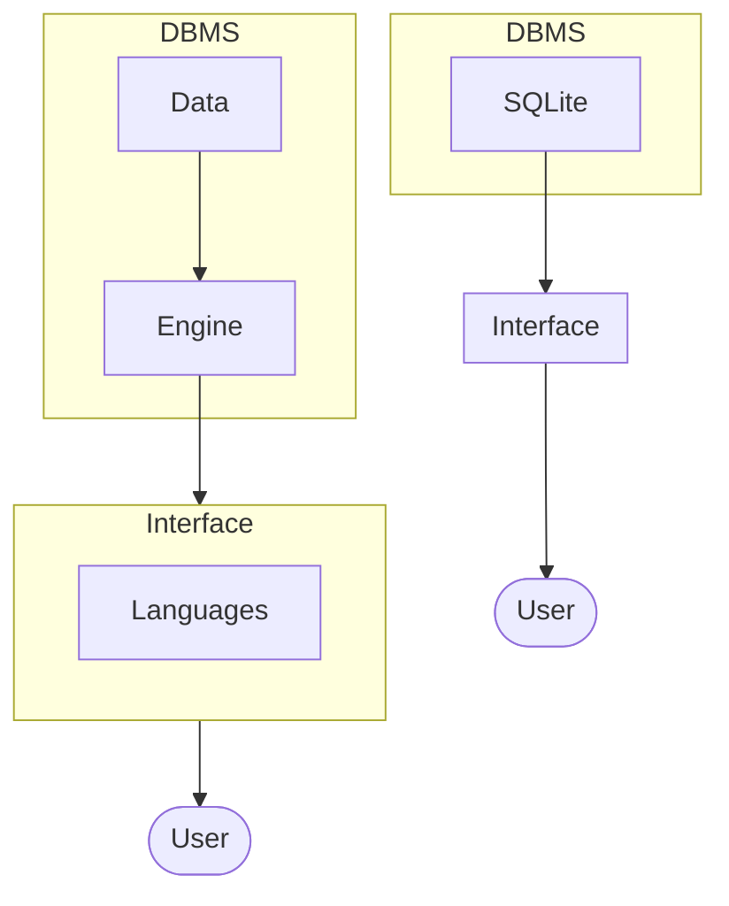
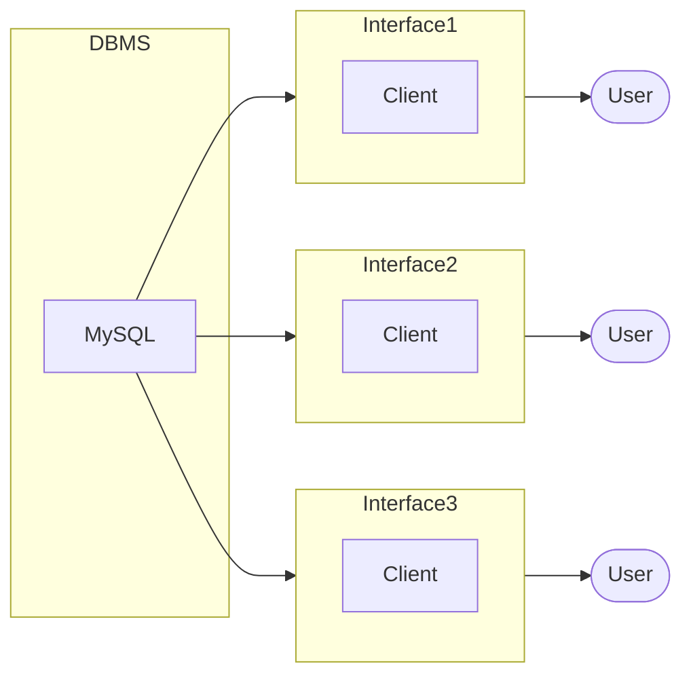

**Slides**
[[Design & implementation of a (relational) database application.pdf]]
#### What is a Database?
- A database (DB) is an entity in which related data can be stored in a structural manner, with as little redundancy as possible.
- A database gives users access to data, which they can view, enter, or update
- Within the limits of the access rights granted to them
- It is viewable (and writable) by many users at the same time - controlled concurrent access

**Types**
- Hierarchic Databases (older)
- Network Databases (older)
- Relational Databases (very common)
	- MySQL
	- PostGres
	- Oracle
	
- Object Oriented Databases (1990s)
- NoSQL Databases (2000s)
	- MongoDB
	
- Vector Databases (The latest trend!)

#### A Relational Database…
- A relational database can be thought of as a series of tables about related information.
	- A database has
		- A `schema` - a blueprint image an interface.
		- a `definition` - using the blueprint creating a table to store data
	
For example Amazons database might have a table called Products:

| ProductID   | Product Title | Description | ISBN      | Supplier | #   |
| ----------- | ------------- | ----------- | --------- | -------- | --- |
| 12312412412 | Bla Bla       | Bla Bla     | 123124213 | 2847     | 5   |

This links to a table called Supplier:

| SupplierID | Address |     |
| ---------- | ------- | --- |
| 2847       | Bla Bla |     |

What operations can be done upon a database?
- Views: read existing data (Imagine roles and policies in middle wear, not sure why this is included in databases)
- Manipulation: Amend existing data, or add new data

How to avoid redundancy:
- Ambiguity 
	- Same thing with different name in different files.
	- Never repeat data, especially constants.
	- Always move into a separate table
- Inconsistency
	- If data changes in one place it should also change in the other files is exists in.
	- ^ Although this shouldn't be need due to relationships
- Wasted Effort
	- Data should be shared where possible to save time and effort.

Having data repeated in different places indicates poor relational database design.

#### Controlled Concurrent Access
Users need to access data at the same time, this causes some issues, imagine you've got two users withdrawing £10 from their bank account with a balance of £100 at the same time, now when they both pull the current balance they both return £100 now once they do the calculation the first one will save and the second user will override it leaving £90 pound.

Databases can have many users reading and writing at the same time 
- We need to make sure that each view of the data is correct or consistent for each user 
- So that concurrent access does not cause incorrect updates 

DBMS have concurrent control software to ensure that several users updating the same data do so in a controlled manner
- This happens through transactions, which make concurrent database interactions appear to happen independently & sequentially

#### Database Management System (DBSM)
The DBSM is a suite of services (software applications) for managing (one or more databases):
- enabling simple access to data 
- allowing multiple users access to the information 
- manipulating the data found in the database (inserting, deleting, editing)

#### Forms of Data Access

**Local Databases**


**Client Server**


#### Designing Database Systems
- Who will use this database?
- What will they see?
- What data will we store?

**Three-Level Architecture**
We can think about a database system at three levels, called "schemas": 

- External: how users view data
- Conceptual: how programmers model and implement the database in the database 
- Internal: how the DBMS stores the data

In designing a database, we take an external schema, Files and design a corresponding conceptual schema. The DBMS handles the internal schema, with hints from the designer

**Summary**
- Databases are used by people… to perform particular tasks, obtain views on the data 
- Databases therefore need interfaces to allow people access to the data 
- Many people may need to access the same database 
- Webpages / Apps are just one way of implementing an interface to a database 
- We must consider the needs of the users when designing a database … our next focus. 
- Database design: taking external schemas to identify the conceptual scheme. The DBMS will handle the internal schema

#### Database Design Lifecycle
Requirements analysis
- Users needs; what must databases do?
Conceptual design
- High-level description; often using entity relationship designs.
Logical design
- Translate Entity Relationship into schema. - [[3. Data modelling and ER Diagrams]]

#### How Do We Go about Designing a Database from Scratch?
A data model:
	Description of how a database can be represented by a computer system with their properties and relationships.
A schema:
	Description of how a database can be designed to represent a data model.

#### People Involved
Users
- access the data only (casual vs. expert)
- need an effective means of accessing the data
Database designers:
- specify schema and content
(web) Application developers:
- extend functionality; 
- provide means of data access for a particular application
Database administrators
- Maintain accuracy, speed and integrity
Web-site designers

#### Identifying User Requirements
Talk to client
- E.g. CEO of the bank, the chief of BT….. 
Talk to customers • End users of the system 
- Those that might view the data 
Talk to different levels of users 
- Admin, programmers, technical staff…. 
- People who might need to add/update/query data

#### Identifying Data Requirements
Write down all the different `THINGS` that you need to store data about:
- Customers, branches, accounts…
- What do we need to know about these things.

Take note of any relationships between the things talked about
- All customers must belong to one branch only 
- All accounts must only have one account number

#### Data Modelling
We need a way to represent all the data we have captured relating to what we want to store in our database.

#### External → Conceptual → Internal
We develop a conceptual data model, based on talking to users and considering existing external views
- High-level description of data, i.e. close to their real world (external) meaning - entity types, attributes & relationships 

The conceptual data model can then be converted into a conceptual schema describing how data is stored 
- For instance as tables and records 
- These are Implementation-level/logical Data Models 

Low-level or Physical Data Models describe how data is internally stored on the computer: • files, storage structures, etc.
- This is handled by the DBMS, with occasional help from the DBA

```sql
-- INFO
Supplier(ID, Name, Address, Postcode)
Product(ID, Supplier, Title)
```


#### Group Work 1
Consider building a database for a UK based postal delivery service provider such as UPS, DHL, Parcel Force etc.

1. What data would you need to store in your database:
	- User
		- Names
		- Delivery Preference
		- Email
		- Password
	
	- Address
		- User ID
		- Postcode
		- Address line 1
		- Address line 2

	- Branch
		- Names
		- Location
		- Number of Employees
		
	- Parcel
		- User ID
		- delivery ID
		-  Address ID
		- From
		- Fragile
		- Names

	- Delivery
		- Date
		- User ID
		- Address ID
		- Driver ID
		- Tracking ID
		- Weight
		- Size
		- Expected Arrival
		- Arrived on
		- Shipped on

	- Driver
		- Names
		- Vehicle
		- Branch ID
- Users
- Admins
- Divers
- Maintainers
- Users - view parcel, driver, delivery, own data and edit own
- Admins - view, query and edit all
- Drivers - view addresses, parcel details and delivery details and update as so
- Maintainers - view, query, edit all, deleting and adding tables, editing schemas
 