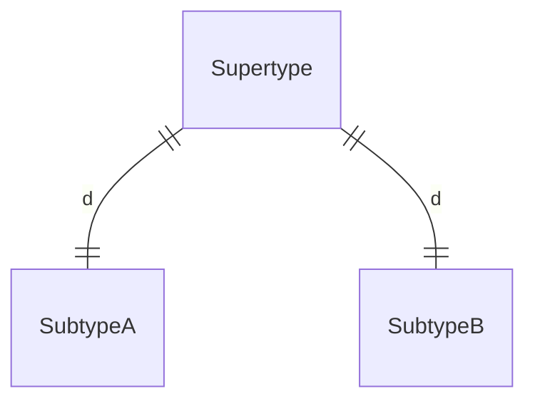
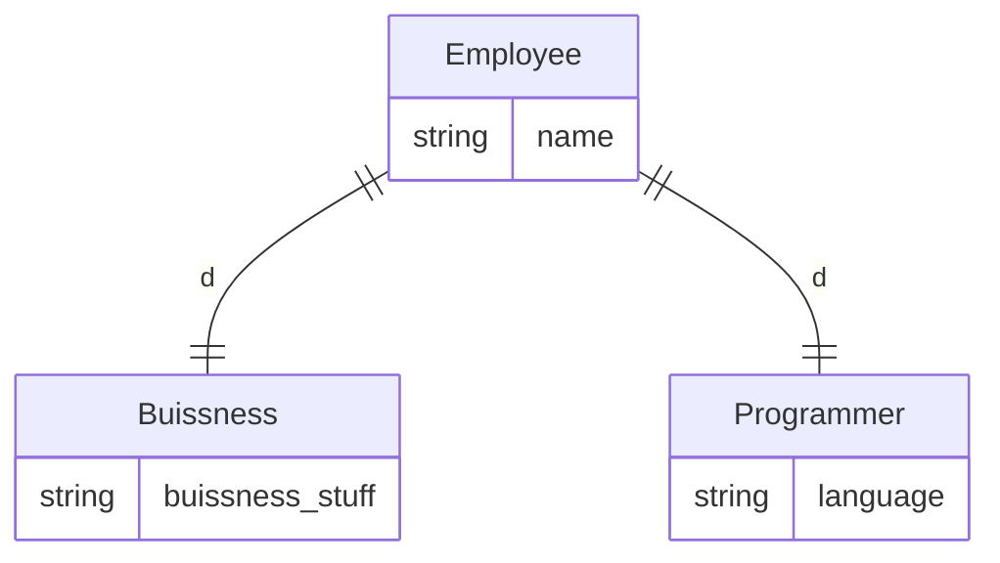
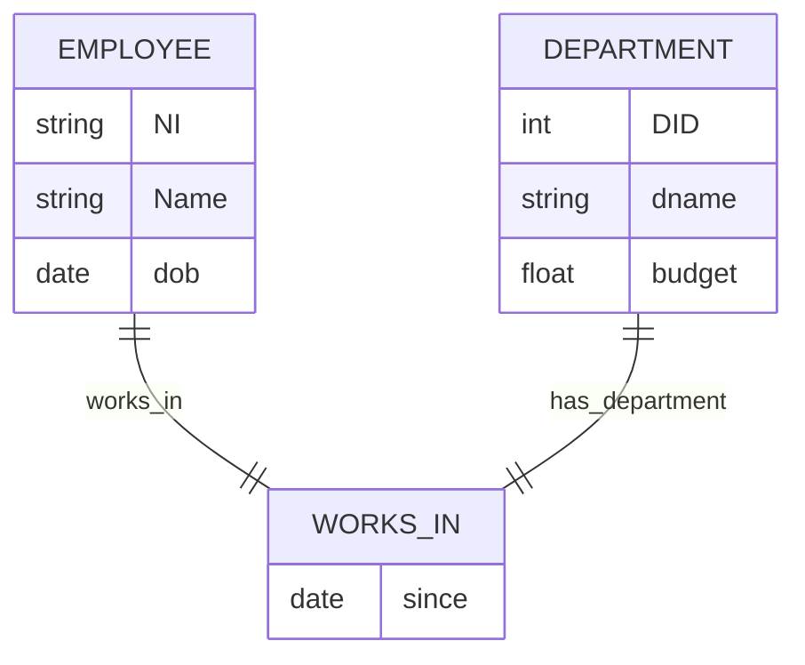
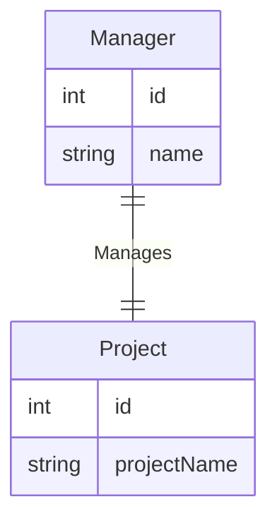
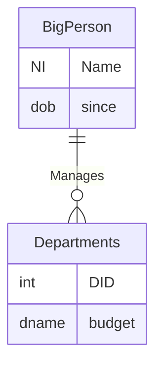
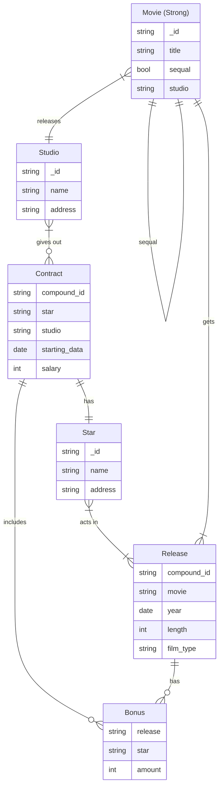
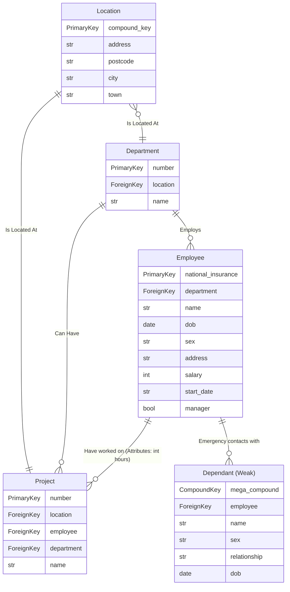
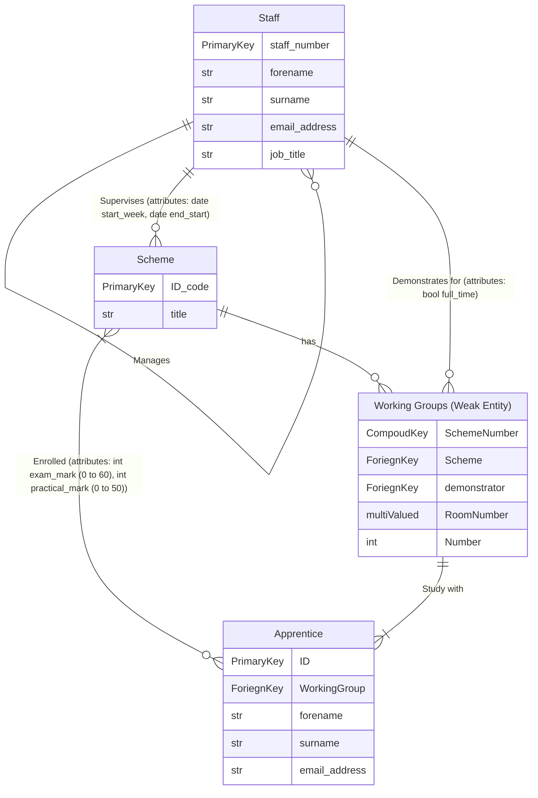

**Slides**
[[3 .Data Modelling, ER Diagram's.pdf]]

| External           | Conceptual Data Model<br>Logical Model (Conceptual Schema)<br> | Physical Model |
| ------------------ | -------------------------------------------------------------- | -------------- |
| Real World (users) | Database Designer                                              | DBMS           |

**A data model is**
- An abstract rep of the data we wish to store 
- A convention for the specification of the logical; structure of real-world info
## Entities
- These are typically real world things such as products, suppliers, customers, and orders.
- An entity is a uniquely identifiable object in the real world about which we wish to store data.
- For example: The Bank of Scotland, The University of Aberdeen, Tony Blair, Celtic Football Club, BBC, my car…….

- Entities are grouped together into 'categories' called entity types or entity sets 
	- Employee, Department, Project
- An entity is an instance of a given entity-type
	- There are usually many instances of an entity-type

- Entity types can be thought of as (common) nouns
	- Can be a physical object such as a house or a car
	- Can be an event such as a house sale or a car service
	- Can be a concept such as a customer transaction

## Attribute
- We identify what we know about each kind of things, what are the properties?
- Image a car, this can have:
	- Red
	- Height
	- Wheel width
- These are all attributes.

- It is expected that all instances of a given entity type will have the same attributes 
	- an entity type defines a set of entities that have the same attributes
	- i.e. We record same details for employees Jane Black and Gregory White
	
Attributes are drawn as ovals, and attached to the boxes representing entity types with lines

### Other Kinds of Attributes
**Simple**
- Invisible value
- age, gender

**Composite**
- Composed of a set of component values
- Address, data of birth - these are both made up of:
	- Address
		- House
		- Street
		- City
		- Town 
		- Postcode
	- DOB

**Single-valued vs multi-valued**
- multi-valued stores a set of values
- Indicated by double-lined attribute oval 

Examples: locations for a department; hobbies for a person

**Derived vs base**
- base are explicitly stored
- derived can be calculated by a procedure

#### Primary Key
An Entity type will usually have key attribute(s): 
- one (or possibly more) of the attributes which are unique for all entity instances 
- for example 
	- A book's ISBN
	- A date (composite attribute M/D/Y)

The primary key attributes of an entity type is an attribute whose values are distinct for each entity
- We underline key attributes

Sometimes several attributes (a composite attribute) together form a key
- NB: Such a composite should be minimal
- E.g. The combination of account number AND sort code are unique in UK banking
	- Sort code finds the branch
	- Account number finds the account

#### Subtyping
A subtype is an entity type that inherits the properties of its parent type
- e.g. programmer & manager can be represented as subtypes of employee

Really comparable to extending a class, it'll inherit all the parents attributes.

Employee attributes (name, NIN, etc) belong to programmer and manager by virtue of being subtypes of employee

Subtypes may be:
- disjoint - must belong to exactly one subtype (use "D")
- inclusive - may belong to either or both (use "O")

Imagine Employee, Programmer and Accountant
- disjoint - employee can be either Programmer or Accountant
- inclusive - employee can be both Programmer and Accountant





## Relationships
- Captures how two or more entity types are related
- Can be thought of as verbs, linking two or more nouns 

- Examples: 
	- an owns relationship between a company and a computer
	- a supervises relationship between an employee and a department
	- a performs relationship between an artist and a song
	- a proved relationship between a mathematician and a theorem

Relationships can also have attributes
- NB: A relationship must be uniquely determined by the participating entities, without reference to the relationship attributes



The Degree of a relationship is the number of entity types participating:

- Binary relationships
	- 2 participating entity types
	- Employee works for Department

- N-ary (e.g. Ternary) relationships
	- > =3 participating entity types 
	- a Manager manages a Project in a Department

### Cardinality Constraints on Relationship Types
The cardinality specifies the number of entity instances that can participate from each side of the relationship of a binary relationship - recap of S6 really.

- One to one (1:1)
- One to many (1:N)
- Many to Many (N:M)

#### One-to-one (1:1)
This is wrote in our notation with a `1` at each end of the relationship, written in mermaid as:


#### One-to-many (1:N)
This is wrote in our notation with a `1` at the one side and `M` at the other, written in mermaid as:



#### Many-to-many (N:M)
This is wrote in our notation with a `N` at the one side and `M` at the other

- Departments may employ more than one person at a time, and an individual person may be employed by more than one department

### Participation Constraints
Every department must have a manage

- A double line indicates a participation constraint - totality
	- Total Participation
	
- all entities in the entity set must participate in at least one relationship in the relationship set;
	- Partial Participation
### Weak Entity Types
These are entity types that do not have primary keys
- Depend on other entities to guarantee uniqueness
- A weak entity type must have total participation in this identifying relationship

These must be `one to one` or `many to one`, `one to many` will cause issues since there will never be an identifier on the many side:
- Imagine a parent with a child, that child doesn't have a pk and relies on the parent table mixed with the partial key of name.
- Now imagine if two children have the same name with the same parent, see doesn't work.

- Parent 
	NI: 123
	- DAVE123
	- DAVE123

- Child 
	Name: Dave
	- DAVE123

- Child 
	Name: Dave
	- DAVE123

- A way to solve this would be a statement on code side to check

Partial key will be underlined, this indicates it's not unique but is used in combination with the foreign key to create a primary key for the weak type.

### More on Relationships
- There may be more than one relationship between entity types
	- An employee can write and present a report
- An entity type may be in a relationship with itself
	- This is a recursive relationship
		- Employee is supervised
		- Employee is a subordinate

## Constructing an ErDiagram
1. Identify the entity types (in boxes)
2. Identify each entity types' properties 
3. Decide which properties are attributes (connected to entity in oval) 
4. Decide which attributes could be keys 
5. Select primary key (underlined attribute) 
6. Determine which properties infer relationships (labelled diamond between the participating entities)
7. Decide on the cardinality and participation of the relationship (numbers at entities involved in relationship; single line Vs double line at entity)
#### The Heading
Each **relation** (table) must have a clear heading that includes:

1. **Name of the relation** (e.g., `Student`)
2. **Attributes of the relation** (the column names):
    - Example: `Name, Student ID, Exam1, Exam2`
    
```
STUDENT (Name, Student ID, Exam1, Exam2)
```
    
The number of attributes (columns) defines the **Degree** of the relation.

#### The Body of a Relation
The **rows** of a relation make up its **body**, with each row representing a single **tuple**.
### Tuples
A **tuple** (or record) is an individual row in the relation, representing a set of attribute values.

- Example tuple:
    `<'Fraser', 880123, 66, 90>`
    - Here, each value's meaning is determined by its position in the tuple:
        - `'Fraser'` is the **Name**
        - `880123` is the **Student ID**
        - `66` and `90` are scores for **Exam1** and **Exam2** respectively.

#### Relation Schema
A **relation schema** defines the structure of a relation, including its attributes and their types. It is typically written as:

```
R (A1, A2, …, An)
```

**Example**:
```
Student (Name: Text, Student ID: Number, Exam1: Number, Exam2: Number)
```
    
Each attribute in a relation schema is associated with a **domain** (data type) that restricts the types of values allowed for that attribute.

### Domains
Domains define the set of possible values each attribute can take, similar to data types in programming languages. Domains also limit the types of operations that can be performed on the attribute values.

- **Example Domains**:
    - **Text**: for attributes like `Name` or `City` (e.g., `VARCHAR`, `CHAR`)
    - **Number**: for numeric values like `Student ID` or exam scores (e.g., `INT`, `FLOAT`)
    - **Date**: for attributes storing dates (e.g., `Date of Birth` with a format like `YYYY-MM-DD`)
    - **Boolean**: for true/false values (e.g., `Is Enrolled`)


## Group Work 2 - The Movie Task
- [x]  🔽 ✅ 2024-11-03

- Set up a database about movies, stars and studios. 
- Movies have a title, and may be released many times. 
- Releases have a year, length and film type. 
- Stars have a name and address. 
- Studios have a name and address. 
- Movies can be sequels of other movies. 
- All stars have contracts with specific studios with an associated salary, and get a cash bonus for specific releases. 
- Stars act in releases and studios own movies.




## Group Work 2 - The Company Task
- [x]  🔽 ✅ 2024-11-03

- A company has a set of departments.
- Each department has a name, number, manager and possibly several locations. 
- The manager is an employee and started managing the department on a given date. 

- A department controls several projects, 
	- each with a name, 
	- number and 
	- location 
	
- Each employee 
	- has a name, 
	- address,
	- salary, 
	- supervisor, 
	- department, 
	- sex, 
	- date of birth 
	- and national insurance number.
	- An employee may work on many projects, not all in their own department, and works X hours on each of these projects. 
	- Each employee has a set of dependents, each with a name, date-of-birth, sex and familial relationship to the employee.



## Coursework Exercise 1:
- [ ]  ⏫ 📅 2024-11-05

For this coursework, you will design an ER Model that captures all of the information in the scenario below and express that model as an ER Diagram using the notation discussed in the lectures. You should submit your ER Diagram to Moodle as a single PDF file. 

***Note: This is an individual piece of work. You should not discuss or work on the solution with anyone else.*** 

The Scenario The National Youth Training Consortium runs training schemes in carpentry, plumbing, engineering, nursing and information technology, and stores details of the apprentices that are enrolled on the schemes, the instructors that supervise the schemes and the tests that the apprentices receive in the schemes they are enrolled on. 

- Some schemes have dedicated working groups that are named numerically in the range [0-6]. 
	- For schemes with working groups, the apprentice's membership of a group is recorded, as well as details of the course demonstrator that teaches the working group.
	- Each scheme has a unique 6 digit identifying code and an alphanumeric title.
	- A training scheme is taken by one or more apprentices and is supervised by one or more instructors. 
	- Each scheme has 0 or more associated working groups, numbered from 1 for each scheme. A working group has one or more apprentices and exactly one demonstrator.
	- It also has room numbers for the classrooms and workshops.

- All staff members have exactly one manager who is also a member of staff. 
	- Demonstrators are members of staff, with an additional binary indication of their status as part-time or fulltime employment.
	- Instructors have a responsibility indicating the start week and end week for their supervising duties.
	- In addition, all instructors are staff members, with a unique staff number (a 12 digit unsigned integer), forename & surname and a job-title.
	
- Each apprentice has a unique ID (a 12 digit unsigned integer), forename & surname, and an email address.
- For each training scheme that an apprentice is enrolled in, there can be an associated end of year exam mark in the range 0 to 60 and a practical mark in the range 0 to 50.



**Assessment:** 
This exercise is worth 5% of your overall course grade.

The exercise is marked out of 6, from a total of 30 marks available for the two pieces of DSR coursework. 

The ER diagram should be submitted electronically via Moodle – a submission link will be available before the deadline.

You will need to scan or print your ER diagram to PDF file for submission. Make sure your name and Student ID number is clearly visible on the submission. Submissions are due before 5pm on Tuesday 5th November 2024