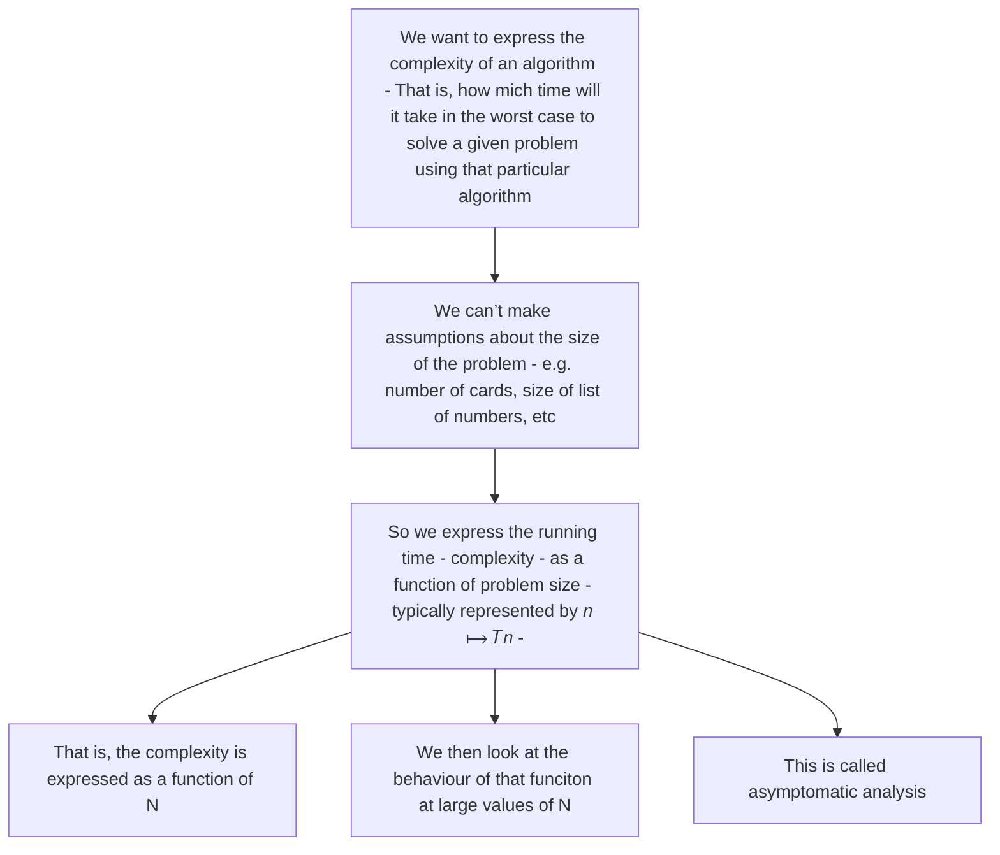

**Slides**
- [[4. Algorithm Analysis.pdf]]

[[2. Analyzing Algorithms - Rules for Comparing]]

***To finish by end of week (1st Nov)***
#### Motivation
What characteristics do you want your program to have???

- Correct
- Readable (Doesn't mean insane amount of comments)
- Reusable (Abstraction)
- Testable
- Elegant

- **Efficient**
	- How *long* will it take to run? (execution time)
	- How much *space* (memory) will it take?
		- Not heavily focused on nowadays
		- We have tons of memory, no need to optimize
			- ^ Take a look back at `TunedIn` caching if you don't remember

#### Execution time = Number of Steps
If we can assume each `step` uses the same amount of time, then we can use the steps taken as a proxy for execution time.

### Evaluating Algorithmic Efficiency for Adding ***n*** Numbers

$$
1 + 2 + 3 + ... + n =
$$
- Let's revest the 'empirical' approach we have in face already taken earlier.

#### Over to the Code:

- Note that version A and B are effectively the same algorithm (both use a loop over all elements) but simply use a different type of loop, so the difference is not algorithmic

---
1. **Time it!**  
  
We are going to execute a few small timing experiments, sneaking in some advanced preparatory work for a key concept that we cover in this course: Algorithmic Analysis. But let's not let these terminologies get in the way for now. We are just writing some code involving loops, and measuring how long they take.  
  
5a) Write a Python program using a *for loop* that sums up the first nn positive integers, where n=10,000,000n=10,000,000 (10 million). Use a timer function to record how long it takes. 

```python
import time

N = 10_000_000
START_TIME = time.time()

total_sum = 0
for index in range(1, N + 1):
    total_sum += index

END_TIME = time.time()

print("For loop sum:", total_sum)
print("For loop time:", END_TIME - START_TIME, "seconds")
```

![[image9.png]]

5b) Now write the same program, but this time use a *while* loop. How long does this this version take?  

```python
import time

N = 10_000_000
START_TIME = time.time()

total_sum = 0
index = 1

while index <= N:
    total_sum += index
    index += 1

END_TIME = time.time()

print("While loop sum:", total_sum)
print("While loop time:", END_TIME - START_TIME, "seconds")
```

![[image8.png]]

5c) Finally, write this program using this *formula* for the sum of the first nn positive integers: 
$$
1 + 2 + \dots + n = \frac{n(n+1)}{2}
$$
```python
import time

N = 10_000_000
START_TIME = time.time()

total_sum = (N * (N + 1)) / 2

END_TIME = time.time()
print("Algo sum:", total_sum)
print("Algo time:", END_TIME - START_TIME, "seconds")
```

![[image10.png]]

***Don't look too hard at this graph, just take a look at the Y-axis, these are fucking micro-seconds, that's insane this graph is really just noise effecting the speed, the main takeaway is time is not related to n***

How long did *this* version take? **DAMMMNNNN***

---

#### Takeaways
 - More than specific performance at specific problem sizes, we are interested in the trends.
	 - How does time complexity scale with the problem size? 

- At small problem sizes, we don't often get a true picture.
	- We should consider large problem sizes for such analysis

![[image.png]]

***A and B's execution time is directly related to the problem size but as you can see from the right graph, C is entirely dependent and obviously the more efficient one.***

### Experimental (or Empirical) Approach vs. ?
Given that:

- We are not really interested in exact times for a specific problem size.
- We are more interested in the trend, the relation between problem size and execution time.

Is there another approach to this??

#### Algorithm Analysis
Analyze the time and space efficiency of an algorithm, without reference to specific implementation details, the way I am thinking right now is just going through specific steps rather than timing exact programs.

> "Algorithm analysis is a way to compare the time and space efficiency of programs with respect to their possible inputs, but irrespective of other context.

#### Empirical Vs Analytical Approach

- What we just did with the three versions of summing up numbers was an empirical approach.
	- We ran experiments with real code, and measured the actual time/space taken.

- What is more useful is a more abstract, analytical approach.
	- Uses a high-level description of the algorithm instead of a specific implementation
	- Characterizes running time (and space) as a function of the input size (𝒏)
	- How does my running time 𝑇 𝑛 change, as I increase my input size 𝑛 

- Analytical studies are essential just creating the graphs above without running any code.

| Empirical Studies                                                                                                                                                                                            | Theoretical Analysis                                                              |
| ------------------------------------------------------------------------------------------------------------------------------------------------------------------------------------------------------------ | --------------------------------------------------------------------------------- |
| You need to implement a possibly difficult algorithm                                                                                                                                                         | Uses a high-level description of steps                                            |
| Results may not be indicative of the run time on other inputs not included in the test.<br><br>Imagine a list of numbers being input, the execution time directly relates to how already sorted the list is. | Characterizes run time as function of input size (*n*)                            |
| In order to compare two algorithms, the same hardware and software components must be used                                                                                                                   | Allows us to evaluate the speed of an algo independently of the hardware/software |
| Results may be more accurate                                                                                                                                                                                 | Results will be *indictive*                                                       |

The questions of the analytical approach are:
- What is precisely the property of the algorithm that we want to capture analytically?
- (Time) Complexity, as in: "how many steps will it require"
- But: best case, worst case, average case? • How do we express it?
- How do we calculate it?

### Sorting a Card Deck of 52 Cards
Here's Waqar's algorithm **(It's a bogo sort WOOOOO!!!)**:

1. Shuffle the deck
2. If it is not sorted, repeat step 1.
3. Deck is now sorted

- Technically this is the best sort in the best, you've seen it before, in the best case it'll only run as:
	- 1 Step

- Average case would be:

$$
52!/2 = 4 000 000 000 000 000 000 000 000 000 000 000 000 000 000 000 000 000 000 000 000 000 000 0 
$$
	  
- Worst case would be:
$$
52 * 51 * 50 * ... * 1 = 
8 000 000 000 000 000 000 000 000 000 000 000 000 000 000 000 000 000 000 000 000 000 000 0 steps
$$


## Asymptomatic Analyisis:
Big-O Notation



We want to describe the running time of a program T, as a function of it's input size n.

What is n?
- 'Size of the problem'
- Can be a single value; e.g. size of list

What is T(*n*)?
- Meant to represent running time
  
### What Does O(f(n)) Represent?
- We make more simplifying assumption in our complexity analyisis: It is only the **Order of Growth** that interests us (rather than the exact expression T(n) of the running time).

- This means we can focus only on the highest-order terms in a formula and ignore others (below this would be 4n^2).

- To give a quick example
	- Given you found T(n) for a particular algo to be
$$
t(n) = 4n^2 + 2n + 10000
$$
	- Then the order of growth is simple n^2
	- this means  𝑇(𝑛) = 4𝑛2 + 2𝑛 + 10000 is of the orde 𝑂(𝑛2)

### Some Common "Orders of Growth" (or "Growth Rates")

#### 0(1) - Constant Run time
Will always be the same amount of time no matter the size of input.

Cleaning house for a party
- No matter how many guests come, cleaning the house prior to their arrival will take the same amount of time

#### O(n) - Linear Growth
Size of input is directly related to the runtime

- Passing the roast around the table at a party
	- If guests are doubled, then wait twice as long to pass it round

- Summing up 𝒏 integers using a loop
	- If you double 𝒏, you will loop 2x more times, and take (roughly) twice as long

#### O(n2) – Quadratic Growth
Everyone in the party gives everyone else a hug
- for 𝑛 guests, it is 𝑛 − 1 + 𝑛 − 2 + ⋯ + 2 + 1
- equal to (𝑛2 − 𝑛) / 2
- the dominant term here is n2 (we will revisit this concept in a bit) • So this is 𝑂(𝑛2)

Multiply two 𝑛-bit numbers

#### O(2n) – Exponential Growth
Doubles size at every step
- "Growth goes completely whack"

Good example of this is the legend of the rice and the chessboard:

>
> *"A wise old ruler wanted to reward his servant for an act of extraordinary bravery. The servant said:*
> 
> 'Master I ask you for just one thing. Take your chessboard and place on the first square one grain of rice. On the first day I will take this grain home to feed my family. On the second day place on the second square 2 grains for me to take home. On the third day cover the third square with four grains for me to take. Each day double the number of grains you give me until you have placed rice on every square of the chessboard. Then my reward will be complete.'
> 
> The wise old ruler replied:_
> 
> This sounds like a small price to pay for your act of incredible bravery, I will ask my servants to do as you ask immediately.'
>

#### 𝑂(log 𝑛) – Logarithmic Growth
The inverse of the exponential function
- You have to double the size of the problem before you need one additional step
- Because every step halves the remaining problem size

Think about a bubble search.

#### 𝑂(𝑛!) – Factorial Growth
Grows real quick, real fast!!

Our initial card shuffling sorting algorithm (Bogo sort) follows this
- There are 52! possible card permutations

### Comparing Growth Rates

![[image1.png]]
***Roughly: logs < roots < polynomials < exponentials < factorials***

## A Couple of Final Points…

- Underlying 'data structure' is critical:
	- Finding median of a list of numbers:
		- O(1) if the list is sorted
		- O(n log n) in general
	
- Fast vs Slow quantification strongly dependent on the given application.
- What is a `primitive` single-step operation? Depends on the underlying hardware architecture and computational model.
	- How long does it take to add two integers?

## Determining Big-O Complexity

1. Counting *primitive operations*
2. Expressing them as a function of the *problem size*: $$ T(n)$$
3. Finding the dominant part of that function that represents its growth rate or it's **Big-O** complexity.

#### First: Looking into the Hardware
We assume with a generic processor, instructions are executed one after another, remember the fetch execute (This means there are no concurrent operations):
- This is called the **RAM Model**

In real-life nowadays we have parallel processing which I believe is due to multiple threads and even multiple cores with multiple threads, this will end up getting really complicated and doesn't make much sense to cover in this course but here's a quick deep dive - [Analysis of Parallel Algorithms](https://en.wikipedia.org/wiki/Analysis_of_parallel_algorithms)

#### Identifying Primitive Operations ("steps") in Algorithmic Analysis
- Basic steps performed by an algorithms
- Imagine low level assembly instructions (+,-,/,x) data movement, control.
- I imagine this could cause some issue with python due to the amount of simplification this does to algorithms (I'm looking at you `.sort()`)
- In calling a function
	- We have an action in calling the function
	- Then it runs the function which can contain many steps
	- Then returning from a function is an action

#### Ignoring Constant Factors

**The Insight**
- Growth rate is not affected by
	- constant factors
	- lower-degree terms

- That is, at large enough n, the function 𝑇(𝑛) is largely determined by the highest degree term in its expression

- So: Big-Oh notation is used to express asymptotic upper bounds.

**Example**
A = 10^2n + 10^5 is a linear function
- A = B + C, where n 
- B = 10^2n is a linear function
- C = 10^5 is a constant **(impact on growth rate can be ignored)***

![[image11.png]]
***A is blue
B is red
C is green***


---

[[2. Analyzing Algorithms - Rules for Comparing]]

---

#### Examples

1. Loop – Summing up squares

```python
SQUARES1(n)
	i := 0 # o(1)
	sum := 0 # o(1)
	
	while i < n # o(n)
		increment i # o(n)
		sum := sum + (i * i) # o(n)
	return sum # o(1)
```

$$
o(1) + o(1) + o(1) + o(n) + o(n) + o(n) = 3o + 3o(n) %{Simplify}%
$$
$$
3o + 3o(n) = o + o(n)  %{Remove Linear}%
$$
$$
o + o(n) = o(n) %{Highest Power}%
$$
2. Square root example

```python
NT-SQRT1(n)
	i := 1 # o(1)

	# o(sqrt(n)) Looping through this physically you will find that this runs for the square root of n
	while (i*i <= n)
		increment i # o(sqrt(n))
	
	return i-1 # o(1)
```


$$
o(1) + o(1) + o(\sqrt{n}) +  o(\sqrt{n}) %{Simplify}%
$$
$$
2o + 2o(\sqrt{n}) = o + o(\sqrt{n})  %{Remove Linear}%
$$
$$
o + o(\sqrt{n}) = o(\sqrt{n}) %{Highest Power}%
$$

1. Nested loop

```python
NEST(n)
	sum = 0 # n(1)

	for i=1 to n # o(n)
		for j=1 to i # o(n^2)
			sum = sum + 1 # 2o(n^2)
```


$$
n(1) + o(n) + 3o(n^2) %{Simplify}%
$$
$$
o(n) + o(n^2)  %{Remove Linear}%
$$
$$
o(n^2) %{Highest Power}%
$$

---

## Problem Sets

### Problem Set 2.1: Algorithmic Thinking and Decomposition
- [x]  🔽 ✅ 2024-11-03
[Link](https://moodle.gla.ac.uk/mod/book/view.php?id=4586542&chapterid=162836)

**1)** Pick up 10 cards randomly `(n=10)`. Apply the algorithm for finding the maximum shown below. Count/estimate the number of "operations".  Repeat this with 5 card as well as 20 cards. Do you note trend between the size of the problem (number of cards NN) and the number of steps to find the maximum?

```
ARRAY-MAX(A)
	max := A[0]
	for i = 1 to n - 1
		if A[i] > max then
			max := A[i]
		{increment counter i}
	return max
```

```python
# Using O Counting

ARRAY-MAX(A)
	max := A[0] # o(1)
	for i = 1 to n - 1  # 2o(n)

		if A[i] > max then # 2o(n) 
			max := A[i] # 2o(n) 

		{increment counter i} # 2o(n)
	
	return max# o(1) 
```

$$ T(n) = o(1) + 2o(n) + 2o(n) + 2o(n) + o(1) $$
Remove out all multiplication, and linear shiz this will leave you with:
$$ T(n) = o(n) $$

**2)** o(n)

**3)** o(n)

**4)** Implement this Array-Max algorithm in Python. Then, perform an **empirical evaluation** where you:

i) Run the experiment for the following values of **n=10,100,1000,10000**.

```python
import random
import time 
import sys

def array_max(array):
	max = array[0]
	
	for index in range(len(array)):
		if array[index] > max:
			max = array[index]

	return max

def gen_array(length):
	return [random.randint(1, 1000) for _ in range(length)]

def measure_performance(FUNC, FUNCTION_NAME, VALUE):
	START = time.time() 

	DATA = FUNC(VALUE) 

	END = time.time() 
	TIME = END - START 
	SIZE = sys.getsizeof(DATA) 

	print(f"{FUNCTION_NAME} - Time: {TIME:.6f}s, Memory Size: {SIZE} bytes")

array_10 = gen_array(10)
measure_performance(array_max, '10', array_10)

array_100 = gen_array(100)
measure_performance(array_max, '100', array_100)

array_1000 = gen_array(1000)
measure_performance(array_max, '1000', array_1000)

array_10000 = gen_array(10000)
measure_performance(array_max, '10000', array_10000)
```


1. Choose a plotting software (Excel probably most convenient, but any would work)

	**Plot these three functions on the *same* axes:**
	
	D. 105n2 + 108n
	E. 105n2
	F. 108n  
	  
	
	+ Plot #1:  
		nn varies from 0-1000
	
	+ Plot #2:  
		nn varies from 0-10,000
	
	Comment on the comparison between the two graphs. Is one of them "misleading"? Why?

	Due to the first graphs small data size we can't really see the difference in the exponential graph4.png

**6)** Analyse the (worst-case) running time of the following algorithms (using big-O notation)

**6a)**

```python
sum = 0 # o(1)

for i = 1 to n # o(n)
	for i = 1 to n # o(n^2)
		sum += array[i][j] # o(n^2) * 3

return max # o(1)
```

$$
o(1) + o(n) + o(n^2) + 3o(n^2)
$$
$$o(1) + o(n) + 4o(n^2)$$
$$o(n) + 4o(n^2)$$
$$o(n^2)$$

**6b)**

```python
sum := 0 # o(1)

for i = 1 to n # o(n)
	for j = 1 to n # o(n^2)
		sum := sum + 1 # o(n^2) * 2
```

$$o(1) + o(n) + o(n^2) + 2o(n^2)$$
$$o(1) + o(n) + o(n^2) + 2o(n^2)$$

$$o(n) + o(n^2)$$
$$o(n^2)$$
**6c)**
```python
sum := 0 # o(1)

for i = 1 to n # o(n)
	for j = 1 to i*j # Pretty sure this is an infinite loop
		for k = 1 to j
			sum := sum + 1
```

$$O(\infty)$$
**7)** Consider the following Python code (which is essentially meaningless mumbo-jumbo, but serves our purpose here). Find its complexity (in big-O notation):

```python

tsum = 0  # o(1)
tprod = 0  # o(1)
tcount = []  # o(1)
mode = int(input("Enter mode (0 or 1): "))  # o(1)

for i in range(n):  # o(n)
	for j in range(n):   # o(n^2)
		tsum = tsum + i + j  # 3o(n^2)
		tprod = tprod * i * j # 3o(n^2)

if (mode): # o(1)
	for k in range(n): # o(n)
		tcount.append(tsum % k) # 2o(n)

done = True # o(1)
```

$$o(1) + o(1) + o(1) + o(1) + o(n) + o(n^2) + 3o(n^2) + 3o(n^2) + o(1) + o(n) + 2o(n) + o(1)$$
$$o(n^2)$$
**8)** Determine the big-O complexity of the following algorithms for adding, multiplying, and transposing (times) matrices.

```python
# 8a: adding two n x n matrices a and b
for i in range(n): # o(n)
	for j in range(n):  # o(n^2)
		c[i][j] = a[i][j] + b[i][j] # 6o(n^2)

# 8b: multiplying two n x n matrices a and b
for i in range(n): # o(n)
	for j in range(n):  # o(n^2)
		c[i][j] = 0   # 3o(n^2)
		for k in range(n):   # o(n^3)
			c[i][j] += a[i][j] * b[i][j] # 6o(n^3)

# 8c: transposing an n x n matrix a
for i in range(n-1): # o(n)
	for j in range(i+1, n) # o(n * n-1)
		tmp = a[i][j] # 3o(n * n-1)
		a[i][j] = a[j][i] # 3o(n * n-1)
		a[j][i] = tmp # o(n * n-1)
```

**8a)** Adding two n x n matrices a and b $$o(n^2)$$
**8b)** Multiplying two n x n matrices a and b $$o(n^3)$$
**8c)** Transposing an n x n matrix a $$o(n^2)$$

### Problem Set 2.2: Algorithmic Analysis with Bubble Sort
- [x]  🔽 ✅ 2024-11-05
[Link](https://moodle.gla.ac.uk/mod/book/view.php?id=4586542&chapterid=162837#mod_book-chapter)

**1)** Continuing with the sneaky tradition of placing plugs of later topics in problem sets, let's have a look at, **bubble sort!**  
  
Bubble sort is an algorithm for sorting a given list of numbers, and one of the more naive ways of solving this problem. We will talk about sorting more a bit later, looking at more efficient sorting algorithms. For now, we focus on bubble sort, and try to analyse it.

[Head here for a quick review of what the bubble sort algorithm is.  
  
](<https://www.bbc.co.uk/bitesize/guides/z2m3b9q/revision/2>)There are some variations on the algorithm, and we are working with this particular version of it, shown in psuedo-code:

**1a)** Analyze the pseudo-code shown above to find the algorithm's big-O complexity.

```python
function bubble_sort(A):

	for outer from n-1 to 0: # o(n)
		for i from 0 to outer-1: # o(n^2)
			if (A[i] > A[i+1]): # 5o(n^2)
				swap(A[i], A[i+1]) # 3o(n^2)

```

$$o(n) + o(n^2) + 5o(n^2) + 3o(n^2)$$
$$o(n^2)$$

**1b)** Implement the above algorithm in Python, and measure the time taken to sort lists of size **100, 1000, 10_000, and 20_000** (updated). The lists should initially be populated randomly with positive integers in the range 0-1000. Compare your empirical observations with the big-O complexity analysis you did in 1a)

```python
import time
import sys
from random import randint

LENGTH = 10_000

def create_random_list(LENGTH):
	LIST = []
	for _ in range(LENGTH):
		LIST.append(randint(0, 100))
	
	return LIST

def bubble_sort(ARRAY):
    length = len(ARRAY)

    for outer in range(length):
        for index in range(outer):
            if ARRAY[index] > ARRAY[index + 1]:
	            TMP = ARRAY[index + 1]
	            ARRAY[index + 1] = ARRAY[index]
	            ARRAY[index] = TMP

    print(ARRAY)

def measure_performance(FUNC, FUNCTION_NAME, VALUE):
	START = time.time() 

	FUNC(VALUE) 

	END = time.time() 
	TIME = END - START 
	SIZE = sys.getsizeof(DATA) 

	print(f"{FUNCTION_NAME} - Time: {TIME:.6f}s, Memory Size: {SIZE} bytes")

arr = create_random_list(LENGTH)
measure_performance(bubble_sort, 'Bubble Sort', arr)
```

| Size of Input | Execution Time |
| ------------- | -------------- |
| 100           | 0              |
| 1000          | 0.032          |
| 10000         | 4.281          |
| 20000         | 17.743         |

![[image24.png]]

***^ As you can see, it's exponential***